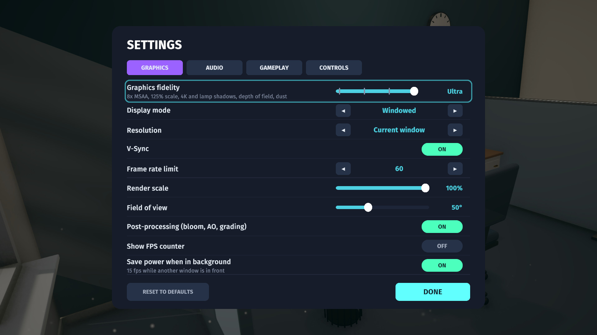
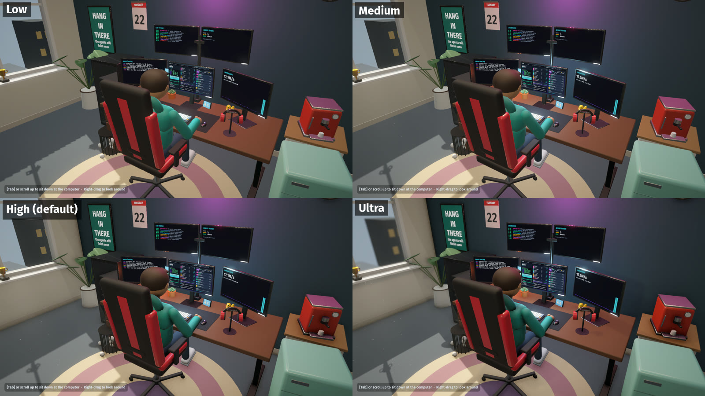
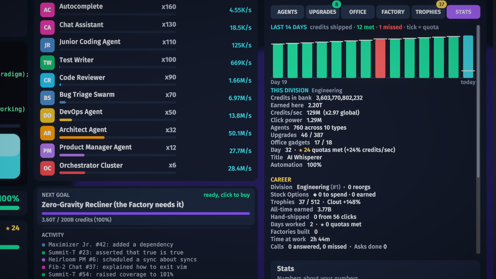

<p align="center">
  
</p>

<h1 align="center">Agent Clicker</h1>

<p align="center"><b>Automate yourself out of a job. Keep the paycheck.</b><br>
An idle clicker about a developer who quietly hands their whole job to AI agents, played on a computer inside a 3D office.</p>

<p align="center">
  
  
  
  
  
</p>

<p align="center">
  <a href="docs/media/trailer.mp4"></a><br>
  <sub>▶ <a href="docs/media/trailer.mp4">Watch the trailer</a> (1:46, 1080p, with sound, recorded at Ultra) · 🎮 <a href="https://nearbycoder.github.io/AgentClicker/"><b>Play it in your browser</b></a></sub>
</p>

> 🎮 **[Play in your browser](https://nearbycoder.github.io/AgentClicker/)** at <https://nearbycoder.github.io/AgentClicker/>:
> about 14 MB to download, no install. It needs WebGL 2 (current Chrome, Edge or Firefox; tested headless in Chromium 151
> and Firefox 157 on Linux, not yet in Safari or on real phones). It's the same game as the desktop build, with these
> differences: it starts on the Medium graphics step (the slider still goes up to Ultra), the save and settings live in that
> browser's storage, sound starts with your first click or key press (browsers require that), there's no Quit button, no
> window, resolution or frame-cap settings and no F12 screenshot, and a tab in the background earns at the offline rate.
> Mouse, keyboard and emulated touch were tested in the browser; a gamepad wasn't. The site is updated from `main` separately, so it can
> lag behind this README (see [Play it](#play-it)).

---

## About

Synergex Corp's CEO has read an article about AI. The memo goes out on Monday morning: Synergex is now
**AI-First**, and every engineer is expected to deliver **10x output** by the end of the quarter.

You are Sam, a developer at a very ordinary desk. Every morning you clock in, sit down and log in to
**CorpOS**, a whole game running on the monitor in front of you. Ship code by hand, earn compute credits and
hire AI agents from a marketplace of (entirely fictional) frontier labs: Hallucin8 Labs, Paperclip Dynamics,
Deep Pocket AI, OmniSapient and more. Agents write the code, review the code and eventually manage the agents
that write the code. Spend the money on gadgets and they appear on your desk. Get promoted and the cubicle
walls come down. Answer the phone, or don't.

The goal is the **Software Factory**: every agent wired into one pipeline, 100% automated, and Sam leaning
back with their feet on the desk. That ends the story, but not the game. After the Factory come frontier
agents, reorgs into new divisions, Stock Options, a Board Room, 512 trophies and numbers that go all the way
to a centillion.

## How to play

Click **SHIP CODE** to earn credits. Spend them in the **ModelMart** on agents, which earn credits every
second, and on upgrades that multiply them. A work day runs from 9 to 5 (five real minutes by default). At 5 PM
you clock out for a performance review, and your agents work the night shift. Keep the rhythm going to build
Focus, catch model drops when they appear, fail over when an API goes down, and keep an eye on the phone.

Leave the game running and it keeps going without you: if nobody touches the mouse or keyboard after 5 PM,
your agents clock Sam out, file the review, go home and log back in the next morning, so production never
stalls on a dialog. Choosing **WORK LATE** keeps that day's overtime, and Settings → Gameplay turns it off. When
you come back after at least one end of day, a **While you were away** card sums up the days, the earnings,
the quotas and the calls and model drops you missed. With the game closed (or a browser tab hidden) your agents earn
10% of their rate for up to an hour, and the same card says how long you were gone, what that earned and whether any
of it went past the hour.

| Keyboard and mouse | Gamepad | Touch (browser) | Action |
|---|---|---|---|
| Mouse | Left stick moves a cursor, **A** clicks | Tap | Point and click anything |
| Click **SHIP CODE**, or `Space` / `Enter` | **RT** or **X** | Tap **SHIP CODE** (two fingers work) | Ship code by hand |
| Hold **SHIP CODE**, `Space` or `Enter` | Hold **RT** or **X** | Hold **SHIP CODE** | Keep shipping, 6 lines a second (with Settings → Gameplay → **Hold to keep shipping** on) |
| Click the monitor | **A** on the monitor | Tap the monitor | Log in each morning |
| Click agents, upgrades, gadgets | **A** on them | Tap them | Buy them (x1, x10, x100 or MAX at a time; **BUY ALL** for upgrades) |
| `Tab` or the on-screen button | **View** | The on-screen button | Switch between the monitor and the office |
| Right-drag (office view) | Right stick | Drag the room | Look around the office |
| Mouse wheel (office view) | **LB** / **RB** | Pinch | Zoom, and zoom in to sit back down |
| | | Two fingers on the monitor | Zoom into the monitor and move around it (small text on a phone) |
| Mouse wheel | Right stick | Drag the list | Scroll a list |
| `E` / `Q` | **Y** / **B** | Tap ANSWER / DECLINE | Answer or decline a ringing phone |
| `1` `2` `3` | D-pad left, up, right | Tap a reply | Pick a reply during a call |
| ✉ **Inbox** (CorpOS top bar) | **A** on it | Tap it | Read the story emails |
| `Esc` or ⚙ | **Start** (**B** closes menus) | ⚙ | Pause menu: settings, how to play, save and exit |
| Arrow keys or `WASD`, then `Enter` / `Space` | D-pad, then **A** | | Move the focus ring through a menu and press; Left / Right change the focused setting or tab |
| `Enter` | **A** (after a D-pad press) | | GO HOME on the review, CLOCK IN on the night screen, LOG IN in the morning |
| `M` or ♪ (CorpOS top bar) | **A** on ♪ | Tap ♪ | Mute all sound, or turn it back on (kept in the settings) |
| `F12` | | | Save a screenshot |

A gamepad drives an on-screen cursor, so everything a mouse can do works with a controller too; the cursor appears when
you touch the gamepad and steps aside when you move the mouse. The menus (title, pause, settings, how to play and the
confirm dialogs) also have a focus ring for the arrow keys and the D-pad, so a whole day can be played without a mouse; the
ring appears with the first key or D-pad press and goes away when the mouse moves. On a touch screen (the browser build on a tablet, or a
phone held sideways) taps work as clicks, the store keeps the details of the last thing you tapped, and the prompts drop
the key names. On a phone the whole monitor makes small text, so spread two fingers on it to zoom in (up to 3×), move them
to look around and pinch to zoom back out; the game shows a tip the first time. While you're zoomed in, a model drop or an
outage that appears out of view gets a chip at that edge of the screen (tap it to go there), and a dialog such as the 5 PM
prompt shows the whole monitor again.

## Features

### A game inside a game

 

CorpOS is a full 2D interface living on the monitor's screen mesh in the 3D office. It stays live and
clickable from the office view, and the camera dollies in until it fills the screen. Clicking types fake code
into the terminal. Steady clicking builds **Focus**, worth up to x3 click power, which drains as soon as you stop.

### Twenty AI agents from eight fictional labs

Hire Autocomplete from Hallucin8 Labs ("Move fast and make things up"), a Junior Coding Agent from Paperclip
Dynamics, a Bug Triage Swarm, a DevOps Agent and an Architect, and eventually a Product Manager Agent that
replaces your manager. Each agent has fifteen upgrade tiers. Forty research upgrades, enterprise contracts and
exclusive lab partnerships stack on top. The store marks the agent with the best production per credit as
★ BEST VALUE, its hover info says roughly how long until you can afford anything, and a **NEXT GOAL** card on the
desktop names the next thing to save for (a new agent type, the Factory's requirements, a reorg worth taking) with
an estimate. Click it to jump to the right store tab.

### Your desk is the upgrade screen

 

Eighteen office gadgets, from a company mug and a rubber duck (10% of clicks crit for x10) to a lava lamp,
an espresso machine, a homelab server rack, a monitor wall, a "SHIP IT" neon sign and a zero-gravity
recliner. Every purchase pops into the 3D office with a camera showcase and has a real bonus. Promotions
change the room too: the cubicle walls disappear, and a rug, a bookshelf, a sofa and trophies arrive. Sticky
notes, pizza boxes and posters pile up as the days go by.

The window follows the clock: a blue morning sky, a sunbeam with dust drifting in it across the floor, a golden afternoon,
a sunset around five and the city's windows lighting up at night.

### Interruptions

 

The desk phone rings. It might be your manager Dana asking for a demo, Gary from IT asking why your Chat
Assistant reset the CEO's password to "hunter2", your desk neighbour Priya, a recruiter, a sales rep, your mom,
or eventually your own agents escalating tickets to you. Every reply has consequences: credits, output boosts,
a meeting that eats 45 minutes of your day, a discount or an outage. Replies also move your **rapport** with
four coworkers, and at +3 each one unlocks a perk. Answering any call breaks your Focus.

**Model drops** are the golden cookie: click the card before it vanishes for Benchmark Hype (x7 production),
a Funding Round or a Caffeine Rush (x77 clicks). **API outages** halve production until you click the banner
enough times to fail over. Every morning Dana hands you two **asks**, and at 5 PM a **performance review**
compares the day against your quota for a star and a bonus, and says how it went against yesterday ("Best day yet ·
+62% on yesterday"). The Stats tab charts the division's last 14 days: what each shipped, its quota, met or missed.

### A story told in emails

Six chapters (The Mandate, The Pilot Program, Scale Out, Who Manages Whom, The Factory and an Epilogue) and
26 story emails from the CEO, your manager, IT, HR, the labs and eventually the agents themselves. The intro
and the epilogue are told in story cards, and the epilogue changes depending on how you treated people.

### The Software Factory, and what comes after

 

Own every agent, five Orchestrator Clusters and the recliner, and you can build the Factory. The monitor shows
the pipeline booting, the camera pulls back, and Sam puts their feet up. Then the endless game opens up:

* **Ten frontier agents**: Agent Foundry, Hyperscale Datacenter, a Digital Twin of Sam, an AGI Intern, a Dyson
  Swarm and finally The Singularity.
* **Reorg** (prestige): roll the Factory out to the next division (Marketing, Sales, Legal, Finance… The Board,
  then Synergex Orbital, Lunar, Interplanetary and an endless multiverse of timelines). You start over in a
  fresh office with **Stock Options**, each worth +1% production forever.
* **The Board Room**: sixteen permanent perks bought with options, including a Starter Kit, Remote Work, a Chief
  of Staff who catches drops for you and a repeatable Board Seat.
* **512 trophies**, each adding Clout, which fifteen influence upgrades (LinkedIn Post … Your Face on Currency)
  turn into production.
* **Big numbers**: every power of a thousand up to a centillion (1e303) has a name, and the credits card spells it
  out ("22.0Qa", with "22.0 quadrillion" above it). Scientific notation is one setting away, and nothing ever overflows.

### Graphics fidelity

 

Settings → Graphics opens with a **Graphics fidelity** slider (mouse, keyboard or D-pad), and a line under it says what the
step does:

| Step | What it does | GPU time, office view* |
|---|---|---|
| **Low** | For weak GPUs: 85% render scale, FXAA instead of MSAA, hard 1K shadows, no ambient occlusion, no sunbeam or dust | 0.42 ms |
| **Medium** | 2x MSAA, soft 2K shadows, the sunbeam with a little dust | 0.79 ms |
| **High** (default) | 4x MSAA, soft shadows, ambient occlusion, the sunbeam with more dust | 1.33 ms |
| **Ultra** | 8x MSAA, 125% render scale, 4K shadows over four cascades, shadows from the ceiling lights, finer ambient occlusion, high-quality bloom, a 64-bit HDR buffer, the densest dust, and a depth of field that keeps Sam and his screens sharp and never blurs the monitor's text | 3.74 ms |

\*Measured on an AMD Radeon 8060S at 1600×900 with Vulkan (`Tools/fidelity.sh`); a larger screen or a weaker GPU costs more.

### Settings, accessibility and quality of life

* **Graphics**: display mode, resolution, V-Sync, a frame cap, render scale, field of view (the monitor view always fits the
  whole screen), post-processing, an FPS counter, and 15 fps while another window is in front.
* **Audio**: master volume and separate sliders for sound effects, music and office ambience, mute when in the background,
  and a ♪ button on the CorpOS top bar (or `M`) that mutes everything at once.
* **Gameplay**: work days of 3, 5, 8 or 12 minutes, running the work day while you're away, tutorial tips, showing off new
  gadgets with the camera, opening important emails automatically, mouse look sensitivity, and short (22.0Qa) or
  scientific (2.20e16) numbers.
* **Accessibility**: **reduce motion** (camera cuts instead of flying, no gadget showcases, and buttons, cards, pulses and
  floating numbers hold still or simply fade), **hold to keep shipping** (hold SHIP CODE, a key or a trigger instead of
  clicking; Focus builds as it does with steady clicks), every menu by keyboard or D-pad, and text sized to stay readable
  on the monitor.
* **Controls**: a Controls tab lists every action for keyboard and mouse, gamepad and touch.

The game autosaves every 15 seconds, and your agents keep earning at a reduced rate while the game is closed.

## Content at a glance

| | |
|---|---|
| Agents | 20 (10 in the story, 10 frontier agents after the Factory) from 8 fictional labs |
| Upgrades | 15 tiers per agent, 40 research, 15 influence, click upgrades, lab contracts and partnerships |
| Office gadgets | 18, each visible in the 3D office |
| Job titles | 15, from Junior Developer to Employee of Every Month |
| Story | 6 chapters, 26 emails, intro and epilogue cards, a memo for every new division |
| Phone calls | 20, with 4 coworkers whose rapport unlocks perks |
| Daily asks | 8 kinds |
| Divisions | 15 named divisions, then numbered timelines forever |
| Board Room perks | 16 |
| Trophies | 512 |
| First Factory | about 3 hours for a person (the balance bot, which never misses a drop, takes 2h 09m) |

## Screenshots

| | |
|---|---|
|  |  |
|  |  |
|  |  |
|  |  |
|  |  |
|  |  |

## Play it

> **Which version is where.** The game on `main` (0.2.0 in the project settings) has had twelve rounds of improvements
> since launch; they're listed in [docs/IMPROVEMENTS.md](docs/IMPROVEMENTS.md). The only published release,
> [**v0.1.0**](https://github.com/nearbycoder/AgentClicker/releases/latest), is the launch-day build of October 4, 2026,
> and the browser copy was last updated on October 6 (it's missing rounds 5–12). For everything described here, including
> the Graphics fidelity slider, the light through the window and the keyboard menus, [build from source](#build-from-source).

### System requirements

* **Desktop**: Linux on x86_64 with a GPU that runs OpenGL Core (the player's default) or Vulkan (`-force-vulkan`); Wayland or X11.
  It has only been tried on CachyOS with KDE Plasma (Wayland) and an AMD Radeon 8060S, where Ultra costs about 3.7 ms
  of GPU time at 1600×900. Low is the step for weak or integrated GPUs.
* **Browser**: a desktop browser with WebGL 2 (checked in headless Chrome and Firefox on Linux), or a tablet or phone
  held sideways (a browser build from `main`; the hosted copy predates touch play); about 14 MB to download. A browser
  without WebGL 2 gets a page that says so instead of the game.
* **Input**: mouse and keyboard, keyboard alone, a gamepad, or touch in the browser.

### Downloads

**Linux (x86_64).** Unzip the Linux zip and run `./AgentClicker.sh`. The launcher starts the game with Unity's
native Wayland backend on a Wayland desktop, because the X11 path can hang at startup under XWayland (set
`AGENTCLICKER_X11=1` to skip that). The v0.1.0 zip predates the launcher: run
`./AgentClicker.x86_64 -force-wayland` there. Command-line options: `-reset` wipes the save and `-daylength 120`
shortens the work day (seconds).

**macOS (experimental).** `AgentClicker-v0.1.0-macos-universal.zip` is a universal (Intel and Apple Silicon)
build made on Linux. It is unsigned and hasn't been tested on a Mac. If macOS refuses to open it, run
`xattr -cr "Agent Clicker.app"` and then `codesign --force --deep -s - "Agent Clicker.app"`.

**In a browser.** Play it at **<https://nearbycoder.github.io/AgentClicker/>** (GitHub Pages, about 15 MB to download; a mouse and keyboard or a gamepad, and a touch screen held
sideways once the site is updated). The hosted copy is the `gh-pages` branch, a plain copy of a browser build from October 6, 2026. It is older
than the game described here: it doesn't have rounds 5–12 (touch play and monitor zoom, home-screen play, the memory fix
below, the away card for a closed game, one-tap FULLSCREEN, the mute button, scrollbars, the longer music, the tab's title,
hold to keep shipping, the day chart, the Graphics fidelity slider, the window's sky and sunbeam, and the keyboard menus),
so those arrive on the site with its next update.
`Tools/build-pages.sh` makes the site: it runs `Tools/unity.sh build-webgl` (Brotli files that decompress themselves,
since GitHub Pages can't send `Content-Encoding`; file names are content hashes, so a cached old page never mixes with a
new build) and lays out `Builds/WebGL` as `Builds/Pages` with a `.nojekyll`, ready to copy onto the `gh-pages` branch. Every
URL is relative, so it works under `/AgentClicker/`. To try it as Pages serves it, copy `Builds/Pages` to
`<dir>/AgentClicker/`, run `python3 -m http.server -d <dir> 8000` and open <http://localhost:8000/AgentClicker/>.
`node Tools/check-pages.mjs <url> [chromium|firefox]` loads a served copy (or the live site) in a headless browser and exits 0
only if it reaches the title screen with every file downloaded and no page or console errors. The page (from
`Unity/Assets/WebGLTemplates/AgentClicker`) fills the browser window, shows a progress bar while loading (and a clear
message with a Try again button if WebGL 2 is missing or a file fails to load), has a
fullscreen button on the title screen (where the browser allows one; iPhones don't; in the game it's in the pause menu and works
in one tap), and asks a phone or
tablet held upright to turn sideways. On a phone, **Add to Home Screen** (Safari's share menu, or Chrome's menu) gives the game its own icon
and opens it full-screen and landscape, without the browser's bars. While another window is in front of the page the game drops to
15 fps to save power (Settings → Graphics). A new browser player starts on the Medium graphics step rather than High: the page
runs on whatever laptop opens it, often at twice the pixel density, and WebGL costs more than the desktop player. The tab's title shows your credits ("22.0Qa credits · Agent Clicker") and puts a model drop,
a ringing phone, an outage or the 5 PM card in front ("★ Model drop! · …"), so a tab beside your work tells you when to look. The save goes to the
browser's storage (IndexedDB), is written the moment you hide or close the tab, and survives a reload. Browsers pause
a tab you aren't looking at, so time in a hidden tab counts like time with the game closed. It has been tried in
headless Chrome and Firefox on Linux; see the known issues below. `Tools/webtest.mjs chromium|firefox` repeats that
check (load, the Medium start and a fidelity change that survives a reload, new game, autopilot login, SHIP CODE, audio level, hire, save on hide, settings, CONTINUE after a reload,
moving a save file into a fresh browser profile, the 15 fps cap behind another window, the web app manifest, the away
card after reopening the page "two hours later", the pause menu's FULLSCREEN, `M` muting the sound, the tab's title, and the long music piece taking over from the loop). Firefox
is driven over WebDriver BiDi, so the system Firefox works without a Playwright browser download. `Tools/webtouch.mjs` plays it by touch alone in Chromium's touch emulation,
at a tablet size and a phone held sideways, including zooming into the monitor.

Saves live in `~/.config/unity3d/Nearby Games/Agent Clicker/` on Linux (Unity's `persistentDataPath`), and
settings are stored separately in PlayerPrefs. **Settings → Gameplay → Save file** moves a career around: the browser
build can DOWNLOAD the save and LOAD FILE… one (it checks the file and asks before replacing your career), and the
desktop build opens its save folder. It's the same `agentclicker_save.json` everywhere, so a career can go from one
browser to another, or between the browser and the desktop game. Each save replaces `agentclicker_save.json` in one step and keeps
the previous one as `agentclicker_save.json.bak`; if the main file is ever missing or damaged, the game loads
the newest readable copy instead.

## Build from source

You need **Unity 6000.6.2f1** with Linux Build Support (Mono), plus Mac Build Support (Mono) for macOS builds and
WebGL Build Support for the browser build. To
regenerate the art you also need **Blender 4.5 LTS**. The Unity project lives in [`Unity/`](Unity): open that
folder in Unity Hub, or drive everything headless with the helper scripts below. `Tools/unity.sh` expects the
editor at `~/Unity/Hub/Editor/6000.6.2f1/Editor/Unity`, or set `UNITY_EDITOR` to its path.

```sh
Tools/unity.sh setup       # URP, post-processing, player settings, reimport models (idempotent)
Tools/unity.sh scene       # regenerate Assets/Scenes/Main.unity from the models (the scene is committed)
Tools/unity.sh tests       # 163 EditMode tests, including the economy balance simulation
Tools/unity.sh build       # Linux player → Builds/Linux
Tools/unity.sh build-mac   # universal macOS player → Builds/Mac
Tools/unity.sh build-webgl # browser build (Brotli, works on any static host) → Builds/WebGL
Tools/play.sh              # run the Linux build (adds -force-wayland on Wayland)
Tools/package.sh v0.2.0    # release zips from the builds above → Builds/Release (Linux zip includes AgentClicker.sh)
```

**Art.** Every model is built from primitives by Python scripts and exported as FBX straight into the Unity
project:

```sh
blender -b --factory-startup -P Blender/scripts/build_all.py                # all models
blender -b --factory-startup -P Blender/scripts/build_all.py -- mug duck    # just these
blender -b --factory-startup -P Blender/scripts/build_all.py -- --preview   # plus preview renders
```

**Audio.** There's nothing to regenerate: the game ships with zero audio files. Sound effects, the office
ambience and the lo-fi music are synthesised when the game starts (`Unity/Assets/Scripts/Util/Sfx.cs`): a 25-second loop
plays first, and a 101-second piece built on it (four sections, one of them a breakdown without drums) takes over at the
loop's next turn. `Tools/unity.sh exec AgentClicker.EditorTools.MusicExport.Run` writes both to `Logs/` as WAV files.

**Balance.** `Tools/unity.sh tests` fails if a greedy bot finishes the first Factory in under 1.5 or over 5
hours, or if later divisions aren't clearly faster than the first. For a ten-division career report, run
`Tools/unity.sh exec AgentClicker.EditorTools.BalanceReport.Career`.

**Media.** The trailer, the teaser loop and the screenshots in `docs/media` are made from the running game:

```sh
Tools/make_trailer.sh          # record every shot at Ultra in a private nested KWin, then edit (needs ffmpeg, python3)
Tools/make_trailer.sh --edit   # re-edit from Recordings/trailer without recording again
Tools/tour.sh                  # screenshot tour of every phase, with layout checks (add -screen-width/-screen-height)
Tools/nested.sh Tools/tour.sh  # the same inside a private nested KWin (no window on your desktop)
Tools/tours.sh Logs/tour       # the tour at all five window shapes it's checked at, each in a nested KWin
Tools/benchmark.sh             # uncapped frame times, GC and render stats in a late-game office
Tools/fidelity.sh Logs/f       # each Graphics fidelity step: same-frame screenshots in three views, frame and GPU times
                               # (in a nested KWin; add "1600x900 -force-vulkan" for GPU times, which OpenGL doesn't report)
Tools/soak.sh 60               # leave a late-game office alone for an hour; memory and objects every 30 s
```

The browser build has the same checks: `Tools/webtest.mjs chromium|firefox` plays through it, `Tools/webtouch.mjs` plays it
by touch, and `Tools/websoak.mjs` soaks it (`detached` runs the browser with no DevTools connection; see the comments at
the top of each for the `playwright-core` and browser they need).

## Project structure

```
Design/GDD.md                 game design document: economy, labs, upgrades, story, pacing
Blender/scripts/              procedural model sources (aclib.py helpers, build_all.py, assets/*.py)
Blender/source/*.blend        the generated .blend files, for opening in Blender
Unity/Assets/Art/Models/      FBX output from Blender (+ employee.anim.json clip ranges)
Unity/Assets/Scripts/Core/    pure C# game model: economy, day cycle, calls, asks, story, career, save, balance sim
Unity/Assets/Scripts/Office/  the 3D office: props, camera rig, employee animation, lighting
Unity/Assets/Scripts/UI/      CorpOS, store, inbox, calls, menus and overlays, all built from code
Unity/Assets/Scripts/Util/    synthesised audio, settings, benchmark, screenshot tour, demo/trailer directors, video capture
Unity/Assets/Editor/          import pipeline, project setup, scene builder, build script, balance report
Unity/Assets/Tests/EditMode/  model, interruption, endless-game and balance tests
Tools/                        unity.sh, play.sh, tour.sh, benchmark.sh, soak.sh, record.sh, make_trailer.sh/.py, web tests
docs/media/                   trailer, teaser loop, poster and screenshots
```

## Tech highlights

* **Everything is generated from code.** Blender scripts build all 46 models from primitives. Material names
  carry meaning (`EMIT_*` glows, `GLASS_*` is transparent, `METAL_*` / `GLOSS_*` / `MATTE_*` set the surface,
  `Screen` marks a monitor), and `ModelImportPipeline.cs` turns them into URP materials on import. An editor
  script builds the scene, and the whole UI is constructed at runtime with uGUI and TextMesh Pro.
* **Light through the window, in shaders.** The sky outside is a small URP shader on a backdrop beyond the city
  (a gradient by view direction, haze, the sun's glow, stars at night) driven by the time of day; the sunbeam is an
  additive prism pushed along the sun's direction from the window opening, and the dust in it is a batch of quads moved,
  wrapped and faced to the camera entirely in the vertex shader, so it costs nothing on the CPU.
* **A rigged, animated employee** made of rigid bone-parented parts. Ten animations (typing, sipping, stretching,
  facepalming, feet up and more) are baked on one timeline and split into clips by the importer. Typing speed
  follows your click rate.
* **The economy is a plain C# model** (`GameModel`) with no Unity dependencies, covered by EditMode tests.
  `BalanceSimulator` plays the game greedily to keep pacing in range, and all money math saturates at the
  largest double, so huge numbers can't turn into NaN or Infinity in a save.
* **Procedural audio.** Key clicks, chimes, the phone ring, the office hum and 76 BPM lo-fi music (Rhodes
  chords, bass, plucked melody, swung drums) are synthesised on a worker thread at startup. The music's 101-second piece
  starts with its own 25-second loop sample for sample, so the loop can play first and hand over on the audio clock.
* **Performance work** for a game that idles in the background: nested canvases so a ticking number only
  rebuilds its own batch, pooled floating numbers faded with CanvasGroups, prewarmed font atlases,
  on-demand reflection probes, and a 15 fps cap when the window is unfocused. A late-game office ran at about
  1.7 ms of main-thread CPU at 60 fps while clicking 15 times a second on a quiet machine. On the shared, busy
  development machine the same benchmark has read anywhere from 2.0 to 5.6 ms for v0.1.0 and later builds alike,
  swinging run to run with the machine's load, so treat absolute numbers from `Tools/benchmark.sh` as
  machine-dependent.
* **A scripted trailer director.** `-trailer` mode plays a shot list at the Ultra step with an on-screen cursor that
  clicks real UI and key presses that drive the menus, all through Input System events; its close-ups use the game's own
  monitor zoom. `VideoCapture` locks time to a fixed 30 fps step, pipes frames to ffmpeg and
  records the game's own audio with `AudioRenderer`. `Tools/make_trailer.py` then cuts the shots, adds the
  captions and title cards, and lays the game's music under the sound effects.

## Credits

Made by [nearbycoder](https://github.com/nearbycoder) (Nearby Games). Every model, sound and line of text was
generated or written for this game.

* Fonts: [Fira Sans](https://github.com/mozilla/Fira) (SIL OFL 1.1) and [DejaVu Sans Mono](https://dejavu-fonts.github.io)
  (Bitstream Vera license), plus Liberation Sans (SIL OFL 1.1) from TextMesh Pro's essential resources.
* Built with [Unity 6](https://unity.com) and the Universal Render Pipeline. Models made with
  [Blender](https://www.blender.org). Trailer edited with [FFmpeg](https://ffmpeg.org) and
  [Pillow](https://python-pillow.org). Developed with [Claude Code](https://claude.com/claude-code).
* Full details are in [THIRD_PARTY_NOTICES.md](THIRD_PARTY_NOTICES.md). Every lab, AI model, company and person
  in the game is fictional.

## Status and known issues

Agent Clicker is complete and playable from the first click to the endless game. Since the first public release
(v0.1.0, October 4, 2026) it has had twelve rounds of improvements on `main`, each with its plan, results and checks in
[docs/IMPROVEMENTS.md](docs/IMPROVEMENTS.md); they haven't been published as a release yet, and the browser copy is
older still (see [Play it](#play-it)).

* **Tested on Linux only**: CachyOS with KDE Plasma on Wayland and an AMD Radeon 8060S. Other distributions
  and GPUs should work but haven't been tried. The screenshot tour checks every phase in a 16:9 (1600×900), a 4:3
  (1024×768), a 21:9 (1680×720), a 16:10 (1280×800, the Steam Deck's shape) and a 32:9 (2560×720) window
  (`Tools/tours.sh` runs all five); no real Steam Deck or super-wide monitor has been tried.
* **XWayland hang**: the Linux player can hang at startup through XWayland. Launch with `-force-wayland`
  (the `AgentClicker.sh` launcher in zips made by `Tools/package.sh`, and `Tools/play.sh`, do this for you).
* **One unexplained crash**: in October 2026 the Linux player crashed once (SIGSEGV on a native worker thread,
  no managed code on the stack) during an automated screenshot tour, while the machine was badly overloaded.
  It hasn't been reproduced or explained: the other four runs that session and 15 runs since (release and
  development builds, at load averages from 15 to 73) were all clean.
* **Long sessions**: an hour of the desktop build left alone (40 in-game days) showed no growth in the game's memory or
  objects. In the browser, the engine's WebGL glue never reused GL object ids, so the page's JavaScript heap grew about
  15 MB an hour while the tab was visible. The game now hands out freed ids again (a small JavaScript plugin that replaces
  the glue's allocator), and 100 minutes in Chrome with nothing attached stayed flat (lowest point 60.3–60.8 MB in every
  15 minutes). That was measured in headless Chrome and checked in Firefox; it hasn't run for days on a real phone. The
  page's live WebGL objects rise once and then stay put: in a two-hour run with nothing attached, the engine's vertex and
  index buffers (the only object type that comes and goes) went from a low of 671 to about 1,030 in the first 15 minutes and
  then held at a low of 1,031–1,045 in every 15 minutes for the next 100, with the JS heap's low points at 60.6–60.8 MB
  throughout. Days-long runs and GPU memory haven't been measured.
* **macOS is experimental**: the build is made on Linux, isn't signed or notarised, and hasn't been run on a Mac.
* **The browser build is new and lightly tested**: it was checked in headless Chrome and Firefox 157 on Linux (start
  a game, autopilot login, audio playing, save, reload, continue, save files), played by touch in Chrome's touch
  emulation, and soaked for two hours in Chrome and 20 minutes in Firefox. A browser tab in the background is paused by the
  browser, so it earns at the offline rate (10% for up to an hour) rather than running the day like a visible tab does.
  Safari and real phones and tablets haven't been tried: touch play was tested in headless Chromium's touch emulation
  (a 1180×820 tablet and an 844×390 phone held sideways) and with simulated touches in the desktop tour, not with real
  fingers, iOS Safari or Android Chrome. Zooming into the monitor and the home-screen web app were checked the same way
  (Chromium reads the manifest), not by adding the game to a real phone's home screen. It's hosted on GitHub Pages; Playwright's WebKit (Safari's
  engine) doesn't start on this CachyOS machine: it is built against Ubuntu 24.04 libraries (ICU 74, flite, libjxl
  0.8). Music starts a few seconds after loading because it's synthesised on the page's only thread.
* **No Windows build yet.** The build script has a Windows target, but it hasn't been built or tested.
* **Gamepad support is new and only tested with a simulated controller**: the tour drives an Input System gamepad
  device with the same events a real one sends (the cursor, and the D-pad and A on the menus' focus ring), but no physical
  controller or Steam Deck has been tried. English only.
* **Graphics fidelity was measured on one GPU**: on this Radeon 8060S at 1600×900, Low to Ultra cost about 0.4, 0.8, 1.3 and 3.7 ms
  of GPU time in the office view (`Tools/fidelity.sh`, Vulkan). Ultra renders at 125% with 8x MSAA, so on a large screen or a weaker
  GPU it can cost far more; nothing else has been tried, and the browser build starts on Medium and was checked at Medium and High.
* **The music was checked by measurement, not by ear**: the long piece's length, its sections, its loop points and its
  level are tested, but nobody has listened to it on this machine.
* **Pacing is tuned by a bot.** The balance tests keep the first Factory between 1.5 and 5 hours for a greedy
  bot; real players will vary.
* **The trailer and screenshots** come from the scripted `-trailer` mode at the Ultra step, recorded offline at a fixed
  30 fps, which jumps between prepared save states to reach each moment. The window-light shot runs the clock from 9 AM to
  8 PM in six seconds, the fidelity shot switches steps on one live view, and the review and Stats chart get two weeks of
  seeded history. Everything on screen is rendered by the game itself; the edit only adds captions, step labels and the
  title and end cards.
* **No license has been chosen yet.** Until one is added, all rights are reserved.
