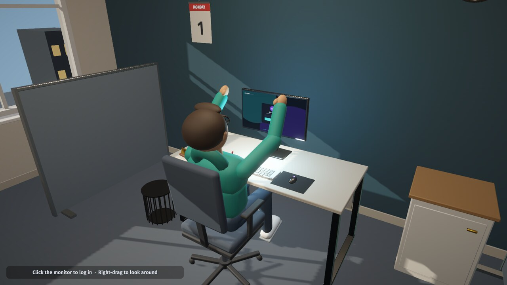
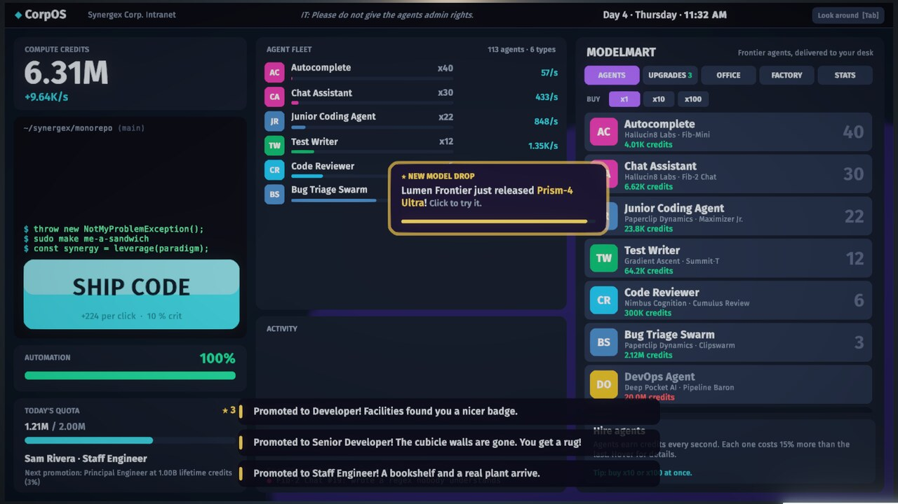
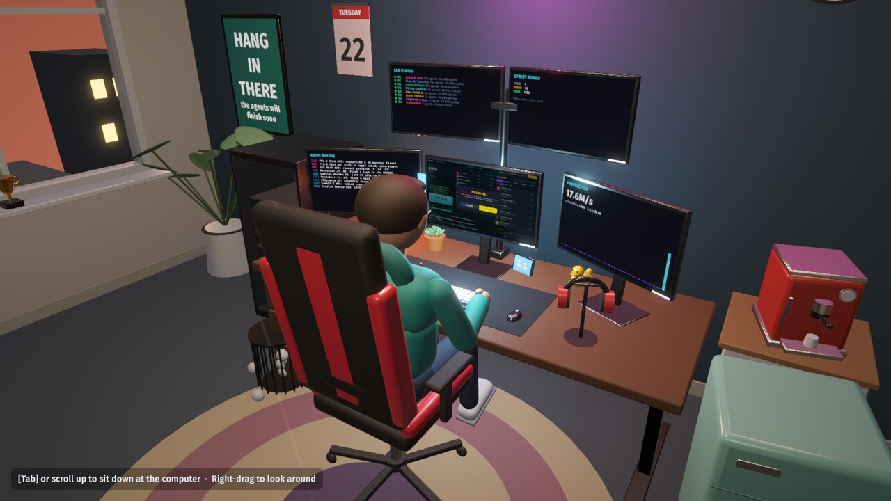
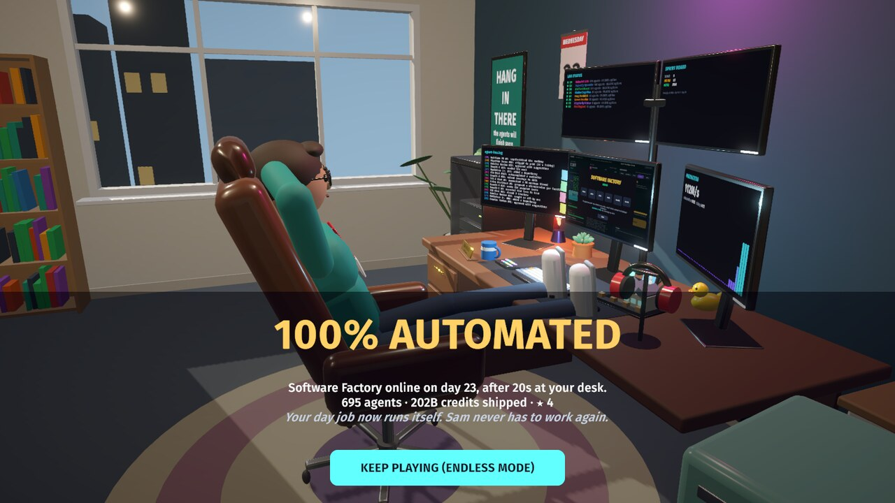

# Agent Clicker

A Cookie Clicker–style idle game about automating your own day job. You play Sam, a developer at
Synergex Corp. Every morning Sam clocks in, sits down at a 3D desk and logs into **CorpOS**, a 2D
game running on the in-world monitor. Ship code by hand, earn compute credits, and hire AI agents from
fictional frontier labs (Hallucin8 Labs, Paperclip Dynamics, OmniSapient…). Keep going until the
**Software Factory** runs the whole job, and Sam can put their feet up on the desk.

The full design (economy, labs, upgrades, office gadgets, day cycle) is in [`Design/GDD.md`](Design/GDD.md).

| Day 1 | CorpOS |
|---|---|
|  |  |
| **Day 22, after a lot of upgrades** | **100% automated** |
|  |  |

## Playing

```sh
Tools/play.sh            # run the Linux build (Builds/Linux/AgentClicker.x86_64)
Tools/play.sh -reset     # wipe the save and start over
Tools/play.sh -daylength 120   # shorter work days (seconds per 9-to-5)
```

| Input | Action |
|---|---|
| Click **SHIP CODE**, or press `Space` / `Enter` | Ship code (earn credits) |
| Click the monitor | Log in each morning |
| `Tab` / on-screen button | Switch between the monitor and the office |
| Right-drag (office view) | Look around |
| Mouse wheel (office view) | Zoom; scroll in to sit back down |
| `Esc` / ⚙ button | Pause menu (settings, how to play, save & exit) |
| ✉ Inbox (in CorpOS) | Read the story emails |
| `E` / `Q` | Answer / decline a ringing phone |
| `1` `2` `3` | Pick a reply on a call |
| `F12` | Save a screenshot |

The game starts on a title screen (Continue, New Game, Settings, How to Play, Credits). **Settings**
covers graphics (quality preset Low–Ultra, display mode, resolution, V-Sync, frame cap, render scale,
FOV, post-processing, FPS counter, background power saving), audio (master, effects, music, ambience)
and gameplay (work day length, purchase camera, tutorial tips, auto-opening story mail, mouse sensitivity).
Settings are stored in PlayerPrefs, separately from your save.

**Interruptions.** The desk phone rings. You might get your manager asking for a demo, IT asking
why your agent reset the CEO's password, Priya begging for your config before her demo, a recruiter,
sales reps, your mom, or eventually your own agents escalating tickets to you. Answer (`E`) and the camera
cuts to Sam on the phone. Pick a reply, and each choice has real effects: credits, output boosts, a 45-minute
meeting that eats your day, a discount, or an outage. Every choice also moves your **rapport** with Dana,
Priya, Gary or Rex. At +3, each person unlocks a perk (lower quotas, shorter outages, fewer outages,
bigger bonuses), and the epilogue changes based on how you treated people. Ignoring an important call
gets noticed. Answering any call **breaks your Focus**.

**Focus & daily asks.** Steady clicking builds Focus, worth up to x3 click power, which fades when you stop.
Every morning your manager hands you two **asks** (hire N agents, ship X by hand, catch a model drop,
over-deliver on quota, answer two calls…) that pay out when done. The store marks the agent with the
best production per credit as ★ BEST VALUE.

**Endless play.** The Factory ends the story, not the game. It unlocks ten **frontier agents** (Agent Foundry,
Hyperscale Datacenter, a Digital Twin of Sam … The Singularity), and every agent has fifteen upgrade tiers,
plus 40 research upgrades. Then you can **reorg**: roll the Factory out to the next division (Marketing,
Sales, Legal … The Board, then Synergex Orbital, Lunar, Interplanetary and an endless multiverse of
timelines). You start over in a fresh office with **Stock Options** (`cbrt(all-time credits / 1e9)`, each
+1% production forever) to spend on permanent **Board Room** perks: Starter Kit, Remote Work, Chief of
Staff, Pack Your Desk, a repeatable Board Seat and more. **512 trophies** add Clout, which influence
upgrades (LinkedIn Post … Your Face on Currency) turn into production. Every later division needs a bigger
Factory (0.1% of your career earnings), so each division has a goal. Numbers are named all the way to a
centillion (1e303). Settings can switch to scientific notation, and nothing overflows. In the
ModelMart, MAX buys as many agents as you can afford and BUY ALL takes every affordable upgrade.

**Story.** Synergex's CEO declares the company "AI-First" and demands 10x output. Sam answers by quietly
automating everything. Over six chapters (The Mandate, The Pilot Program, Scale Out, Who Manages Whom,
The Factory, Epilogue) 26 emails from the CEO, your manager Dana, your desk neighbour Priya, IT, HR,
the labs and eventually the agents themselves arrive in the CorpOS inbox. Hiring the Product Manager agent
replaces your manager, who then writes your performance reviews. New games open with an intro, and
building the Factory unlocks an epilogue and a credits roll.

Each division after the first opens with a memo from somebody at Synergex.

The game autosaves every 15 seconds to `~/.config/unity3d/Nearby Games/Agent Clicker/agentclicker_save.json`.
While the game is closed, your agents earn 10% of their normal rate for up to an hour (25% for 4 hours with
Remote Work, 50% for 24 hours with Unlimited PTO). Older saves are upgraded automatically.

## Project layout

```
Design/GDD.md                 game design document
Blender/scripts/              procedural model sources (Python)
  aclib.py                    shared modelling + FBX export helpers
  build_all.py                builds every asset (or the ones named) into Unity
  preview.py                  renders preview PNGs (Blender/previews, git-ignored)
  assets/*.py                 furniture, electronics, gadgets, room, employee (rig + animations)
Blender/source/*.blend        the generated .blend files, for opening in Blender
Unity/                        Unity 6 (6000.6) URP project
  Assets/Art/Models/          FBX output from Blender (+ employee.anim.json clip ranges)
  Assets/Scripts/Core/        pure C# game model: economy, day cycle, events, story, settings, save, balance sim
  Assets/Scripts/Office/      3D office: props, camera, employee animation, lighting
  Assets/Scripts/UI/          CorpOS (world-space uGUI/TMP built from code), inbox, menus/settings, overlay, side monitors
  Assets/Editor/              import pipeline, project setup, scene builder, build script
  Assets/Tests/EditMode/      model + balance tests
Tools/                        unity.sh, play.sh, tour.sh, extract_unitypackage.py
```

## Pipeline

All the art and the scene are generated from code, so the whole game can be rebuilt from scratch:

```sh
blender -b --factory-startup -P Blender/scripts/build_all.py               # all models → Unity
blender -b --factory-startup -P Blender/scripts/build_all.py -- mug duck   # selected models
blender -b --factory-startup -P Blender/scripts/build_all.py -- --preview  # + preview renders

Tools/unity.sh setup    # URP, post-processing, player settings, reimport models (idempotent)
Tools/unity.sh scene    # regenerate Assets/Scenes/Main.unity from the models
Tools/unity.sh tests    # EditMode tests + balance report (first Factory + a 4-division career)
Tools/unity.sh exec AgentClicker.EditorTools.BalanceReport.Career   # 10-division career, 1 h after each Factory
Tools/unity.sh build    # Linux player → Builds/Linux
Tools/tour.sh           # the build plays every phase and saves screenshots to /tmp/agentclicker-tour
Tools/benchmark.sh      # uncapped frame times, GC and render stats in a late-game office
Tools/record.sh         # records the scripted showcase to Recordings/agent-clicker-gameplay.mp4
Tools/unity.sh build-dev  # development build; its -benchmark run adds per-system profiler markers
```

How the pieces fit together:

* **Blender → Unity.** Every model is built from primitives in Python and exported as FBX. Material
  names carry meaning: `EMIT_*` glows, `GLASS_*` is transparent, `METAL_*` / `GLOSS_*` / `MATTE_*` set
  the surface, and `Screen` marks a monitor surface. `ModelImportPipeline.cs` turns those into URP/Lit
  materials. Unity bakes the axis conversion into each FBX root, so the scene builder places
  every model under a holder object and never overwrites the imported transform.
* **The employee** is an armature with rigid, bone-parented mesh parts. All ten animations (Idle, Typing,
  Stretch, Relax, FeetUp, Celebrate, Facepalm, Sip, Think, LookAround) live on one baked timeline. A
  mug parented to the right hand appears only while sipping. Typing speed follows your click rate, and
  idle moments trigger small variations. `employee.anim.json` tells
  the importer where to split it into clips.
* **The office evolves** through `OfficeProp` conditions such as `office:monitor2`, `title>=2`,
  `day>=5&day<9` or `factory`. Purchases pop items in with a camera showcase; promotions and new days
  change the room.
* **CorpOS** is a world-space canvas sitting on the main monitor's screen mesh. It stays live and
  clickable from the office view, and the camera dollies in to make it fill the screen.

## Performance

Measured with `Tools/benchmark.sh` on the dev machine (Radeon 8060S, 1600×900, High preset, late-game
office): about 1.3–1.5 ms per frame uncapped, with **1.7 ms of main-thread CPU at 60 fps** while clicking
15 times a second. The main optimisations:

* Nested canvases per column and card, plus a tiny canvas for every animated element, so a ticking number
  only rebuilds its own batch. UI batch rebuilds dropped from 1.2 to about 0.45 ms per frame.
* Floating "+N" numbers are pooled and fade with a CanvasGroup. Changing a TMP colour regenerates the text
  mesh, so text regeneration dropped from 0.5 to 0.1 ms per frame.
* Text only updates when it changes. Panels refresh at 10, 3 and 2 Hz instead of every frame, and hot paths
  avoid LINQ and string concatenation.
* Glyphs are prewarmed into the dynamic font atlases, which removed a 30 ms hitch on the first click.
* The reflection probe renders on demand (new furniture, a new in-game hour) instead of every 4 seconds.
  Lighting updates track the game clock rather than every frame, and static architecture is batched.
* Second pass, after adding calls, asks and focus, re-profiled with per-frame GC counters in a development
  build. Monitor view was allocating a small array every frame to compute the screen frame, and agent
  lookups used a capturing lambda. Ask text now only rebuilds when progress changes. Idle allocation
  dropped from 325 to 122 B/frame, and GC churn at 60 fps while clicking dropped from 180 to 59 KB/s,
  with no collections during a 10 s clicking burst.
* Third pass, for the endless game, benchmarked in a worst-case save (all 20 agent types, 267 upgrades,
  168 trophies, numbers around 1e40). The trophy wall is a fixed grid: in a scroll view, the masked list re-culled
  about 500 squares every frame. Store and fleet rows only rebuild their strings when a value changes, upgrade
  tiles are pooled, the activity feed reuses one StringBuilder, and production stats only re-aggregate upgrades
  when you buy one. The endless state costs the same UI time per frame as the old late game in the same
  run, and allocates about 840 B/frame at 60 fps while clicking. All money math saturates at the largest
  double, so huge numbers can't turn into NaN or Infinity.
* The quality presets scale MSAA, shadow resolution and distance, SSAO, light count and render scale.
  When the window is unfocused the game drops to 15 fps, since an idle game spends its life in the background.

## Gameplay video

`Tools/record.sh` launches the build with `-record`. A scripted director (`Assets/Scripts/Util/Demo.cs`) then
plays the game with an on-screen cursor that clicks real UI through Input System events. The playthrough
covers the title, intro, day 1, a phone call, a model drop, two time-skips, an outage, the clock-out and
review, the Factory and the epilogue. `VideoCapture` locks time to 30 fps steps (`Time.captureFramerate`),
pipes each frame to ffmpeg/x264, and records the game's own audio with `AudioRenderer`. The result is
`Recordings/agent-clicker-gameplay.mp4` (git-ignored).

## Adding content

* **A new agent** is one `AgentDef` line in `GameDatabase.cs`. Its five tier upgrades and its lab's
  contract are generated for you.
* **A new office gadget** needs three things: an `OfficeItemDef` in `GameDatabase.cs`, a Blender build
  function in `Blender/scripts/assets/*.py`, and a `Place(...)` call in `SceneBuilder.cs` with condition
  `office:<id>`. Then rebuild the models and the scene.
* **After changing numbers**, run `Tools/unity.sh tests`. The balance test fails if a greedy bot
  finishes the factory in under 1.5 hours or over 5 hours, and the career test fails if later divisions
  aren't clearly faster than the first.
* **Trophies** are mostly generated (`Core/Achievements.cs`): adding an agent automatically adds its ten
  agent-count trophies and fifteen upgrade tiers.

## Machine notes (CachyOS / Wayland)

* The Unity editor links against `libxml2.so.2`, which Arch has replaced with `.so.16`. `Tools/unity.sh`
  adds `~/.local/share/ptt-unity-libs` to `LD_LIBRARY_PATH`. Installing `libxml2-legacy` fixes it properly.
* The built player hangs at startup through XWayland, so `Tools/play.sh` passes `-force-wayland`.
* The TMP Essential Resources package can't be imported in batch mode, so
  `Tools/extract_unitypackage.py` unpacks it into the project. It's already committed under
  `Unity/Assets/TextMesh Pro`.

## Credits

Fonts: Fira Sans (SIL OFL) and DejaVu Sans Mono (Bitstream Vera license). Their licence texts are in
`Unity/Assets/Resources/Fonts`. Every lab, model and company in the game is fictional.
