<p align="center">
  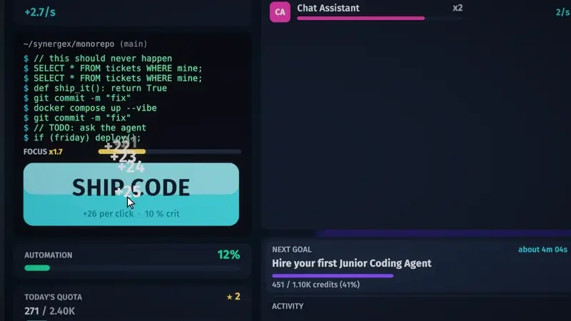
</p>

<h1 align="center">Agent Clicker</h1>

<p align="center"><b>Automate yourself out of a job. Keep the paycheck.</b><br>
An idle clicker about a developer who quietly hands their whole job to AI agents, played on a computer inside a 3D office.</p>

<p align="center">
  
  
  
  
  
</p>

<p align="center">
  <a href="docs/media/trailer.mp4">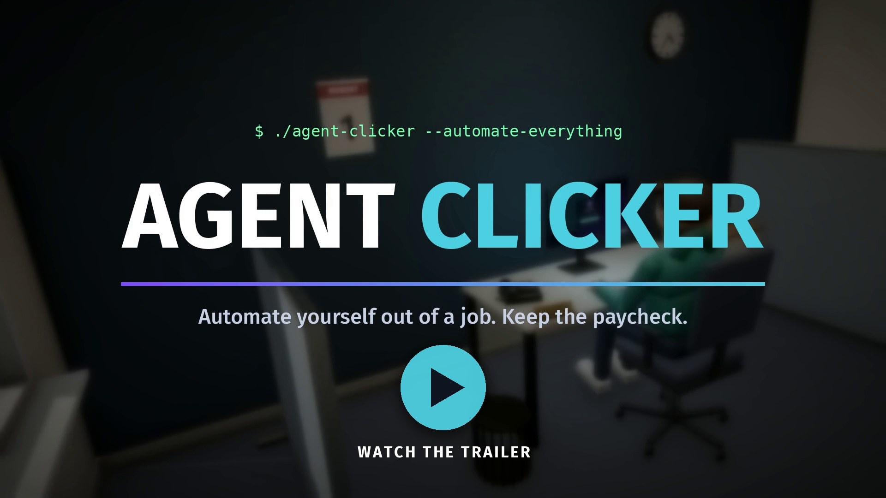</a><br>
  <sub>▶ <a href="docs/media/trailer.mp4">Watch the trailer</a> (1:41, 1080p, with sound)</sub>
</p>

---

## About

Synergex Corp's CEO has read an article about AI. The memo goes out on Monday morning: Synergex is now
**AI-First**, and every engineer is expected to deliver **10x output** by the end of the quarter.

You are Sam, a developer at a very ordinary desk. Every morning you clock in, sit down and log in to
**CorpOS**, a whole game running on the monitor in front of you. Ship code by hand, earn compute credits and
hire AI agents from a marketplace of (entirely fictional) frontier labs: Hallucin8 Labs, Paperclip Dynamics,
Deep Pocket AI, OmniSapient and more. Agents write the code, review the code and eventually manage the agents
that write the code. Spend the money on gadgets and they appear on your desk. Get promoted and the cubicle
walls come down. Answer the phone, or don't.

The goal is the **Software Factory**: every agent wired into one pipeline, 100% automated, and Sam leaning
back with their feet on the desk. That ends the story, but not the game. After the Factory come frontier
agents, reorgs into new divisions, Stock Options, a Board Room, 512 trophies and numbers that go all the way
to a centillion.

## How to play

Click **SHIP CODE** to earn credits. Spend them in the **ModelMart** on agents, which earn credits every
second, and on upgrades that multiply them. A work day runs from 9 to 5 (five real minutes by default). At 5 PM
you clock out for a performance review, and your agents work the night shift. Keep the rhythm going to build
Focus, catch model drops when they appear, fail over when an API goes down, and keep an eye on the phone.

Leave the game running and it keeps going without you: if nobody touches the mouse or keyboard after 5 PM,
your agents clock Sam out, file the review, go home and log back in the next morning, so production never
stalls on a dialog. Choosing **WORK LATE** keeps that day's overtime, and Settings → Gameplay turns it off.

| Input | Action |
|---|---|
| Click **SHIP CODE**, or `Space` / `Enter` | Ship code by hand |
| Click the monitor | Log in each morning |
| Click agents, upgrades, gadgets | Buy them (x1, x10, x100 or MAX at a time; **BUY ALL** for upgrades) |
| `Tab` or the on-screen button | Switch between the monitor and the office |
| Right-drag (office view) | Look around the office |
| Mouse wheel (office view) | Zoom, and scroll in to sit back down |
| `E` / `Q` | Answer or decline a ringing phone |
| `1` `2` `3` | Pick a reply during a call |
| ✉ **Inbox** (CorpOS top bar) | Read the story emails |
| `Esc` or ⚙ | Pause menu: settings, how to play, save and exit |
| `F12` | Save a screenshot |

Agent Clicker is played with a mouse and keyboard. There is no gamepad or touch support.

## Features

### A game inside a game

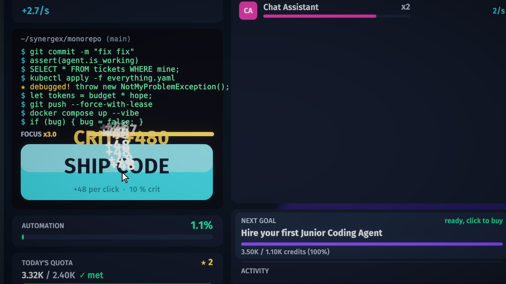 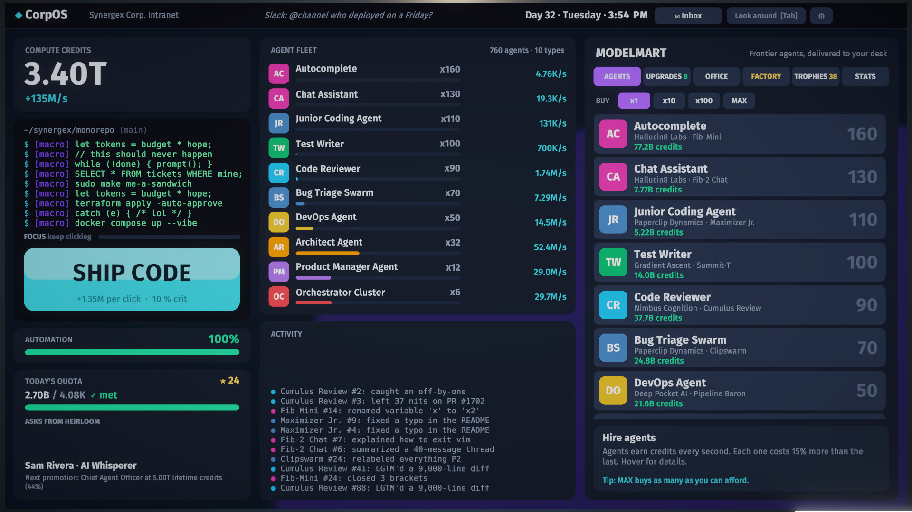

CorpOS is a full 2D interface living on the monitor's screen mesh in the 3D office. It stays live and
clickable from the office view, and the camera dollies in until it fills the screen. Clicking types fake code
into the terminal. Steady clicking builds **Focus**, worth up to x3 click power, which drains as soon as you stop.

### Twenty AI agents from eight fictional labs

Hire Autocomplete from Hallucin8 Labs ("Move fast and make things up"), a Junior Coding Agent from Paperclip
Dynamics, a Bug Triage Swarm, a DevOps Agent and an Architect, and eventually a Product Manager Agent that
replaces your manager. Each agent has fifteen upgrade tiers. Forty research upgrades, enterprise contracts and
exclusive lab partnerships stack on top. The store marks the agent with the best production per credit as
★ BEST VALUE.

### Your desk is the upgrade screen

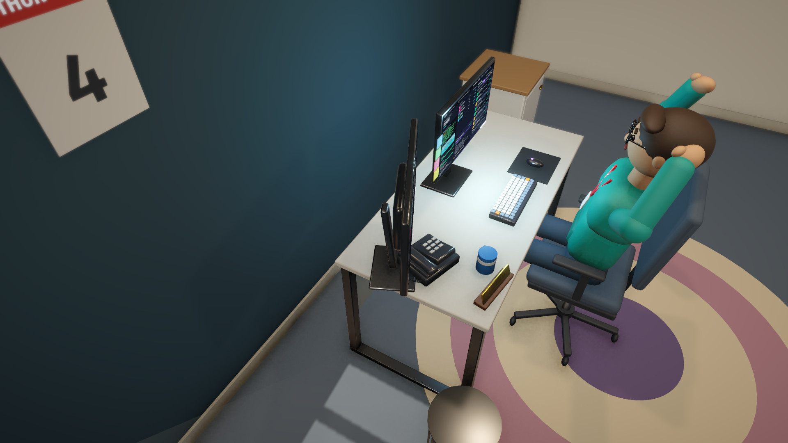 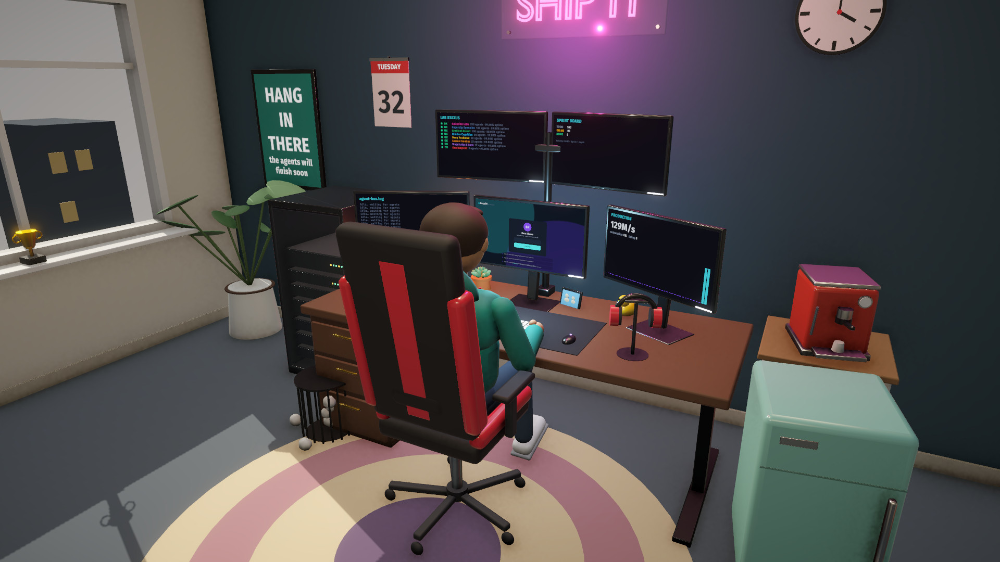

Eighteen office gadgets, from a company mug and a rubber duck (10% of clicks crit for x10) to a lava lamp,
an espresso machine, a homelab server rack, a monitor wall, a "SHIP IT" neon sign and a zero-gravity
recliner. Every purchase pops into the 3D office with a camera showcase and has a real bonus. Promotions
change the room too: the cubicle walls disappear, and a rug, a bookshelf, a sofa and trophies arrive. Sticky
notes, pizza boxes and posters pile up as the days go by.

### Interruptions

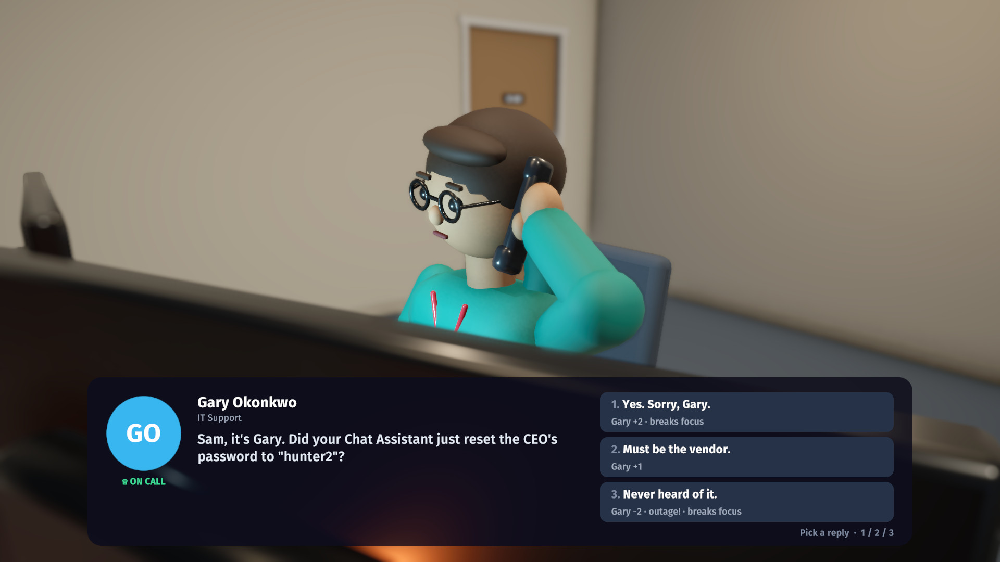 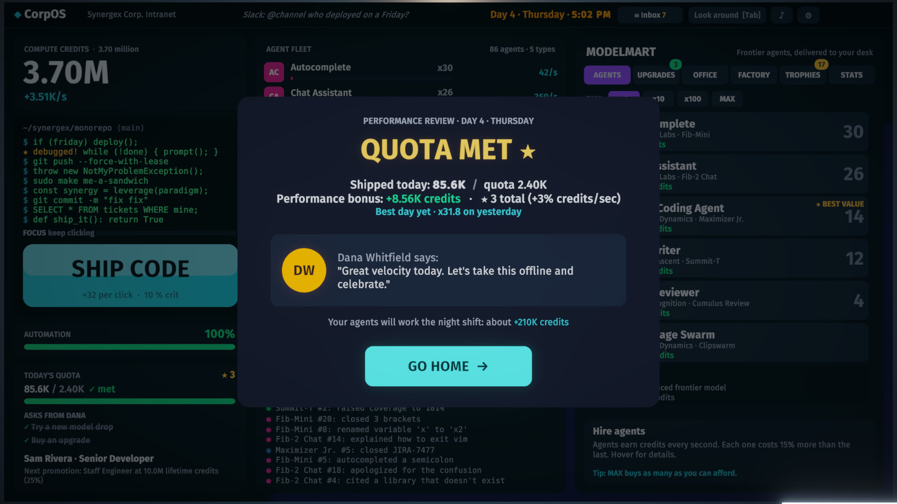

The desk phone rings. It might be your manager Dana asking for a demo, Gary from IT asking why your Chat
Assistant reset the CEO's password to "hunter2", your desk neighbour Priya, a recruiter, a sales rep, your mom,
or eventually your own agents escalating tickets to you. Every reply has consequences: credits, output boosts,
a meeting that eats 45 minutes of your day, a discount or an outage. Replies also move your **rapport** with
four coworkers, and at +3 each one unlocks a perk. Answering any call breaks your Focus.

**Model drops** are the golden cookie: click the card before it vanishes for Benchmark Hype (x7 production),
a Funding Round or a Caffeine Rush (x77 clicks). **API outages** halve production until you click the banner
enough times to fail over. Every morning Dana hands you two **asks**, and at 5 PM a **performance review**
compares the day against your quota for a star and a bonus.

### A story told in emails

Six chapters (The Mandate, The Pilot Program, Scale Out, Who Manages Whom, The Factory and an Epilogue) and
26 story emails from the CEO, your manager, IT, HR, the labs and eventually the agents themselves. The intro
and the epilogue are told in story cards, and the epilogue changes depending on how you treated people.

### The Software Factory, and what comes after

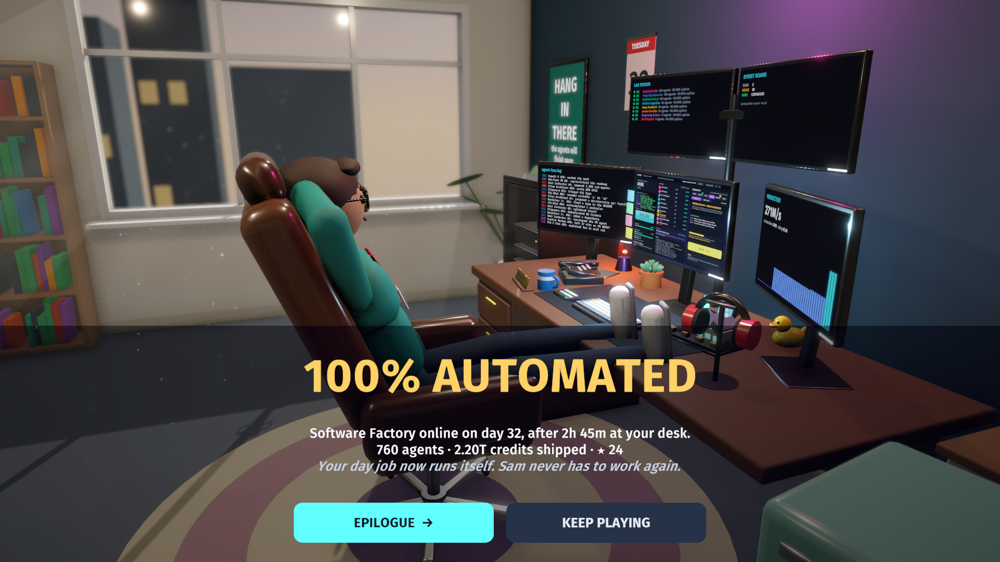 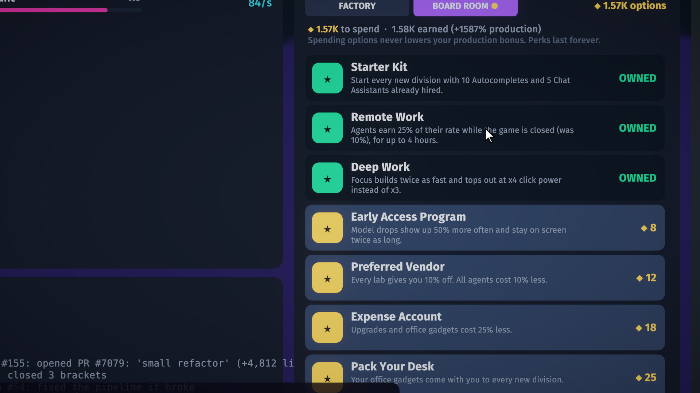

Own every agent, five Orchestrator Clusters and the recliner, and you can build the Factory. The monitor shows
the pipeline booting, the camera pulls back, and Sam puts their feet up. Then the endless game opens up:

* **Ten frontier agents**: Agent Foundry, Hyperscale Datacenter, a Digital Twin of Sam, an AGI Intern, a Dyson
  Swarm and finally The Singularity.
* **Reorg** (prestige): roll the Factory out to the next division (Marketing, Sales, Legal, Finance… The Board,
  then Synergex Orbital, Lunar, Interplanetary and an endless multiverse of timelines). You start over in a
  fresh office with **Stock Options**, each worth +1% production forever.
* **The Board Room**: sixteen permanent perks bought with options, including a Starter Kit, Remote Work, a Chief
  of Staff who catches drops for you and a repeatable Board Seat.
* **512 trophies**, each adding Clout, which fifteen influence upgrades (LinkedIn Post … Your Face on Currency)
  turn into production.
* **Big numbers**: every power of a thousand up to a centillion (1e303) has a name, scientific notation is one
  setting away, and nothing ever overflows.

### Settings and quality of life

Graphics presets from Low to Ultra (MSAA, shadows, SSAO, render scale), display mode, resolution, V-Sync, a
frame cap, field of view and post-processing. Separate volume sliders for effects, music and ambience. Work
days of 3, 5, 8 or 12 minutes, running the day while you're away, tutorial tips, a purchase camera toggle and
mouse sensitivity. The game
autosaves every 15 seconds, and your agents keep earning at a reduced rate while the game is closed.

## Content at a glance

| | |
|---|---|
| Agents | 20 (10 in the story, 10 frontier agents after the Factory) from 8 fictional labs |
| Upgrades | 15 tiers per agent, 40 research, 15 influence, click upgrades, lab contracts and partnerships |
| Office gadgets | 18, each visible in the 3D office |
| Job titles | 15, from Junior Developer to Employee of Every Month |
| Story | 6 chapters, 26 emails, intro and epilogue cards, a memo for every new division |
| Phone calls | 20, with 4 coworkers whose rapport unlocks perks |
| Daily asks | 8 kinds |
| Divisions | 15 named divisions, then numbered timelines forever |
| Board Room perks | 16 |
| Trophies | 512 |
| First Factory | about 3 hours for a person (the balance bot, which never misses a drop, takes 2h 09m) |

## Screenshots

| | |
|---|---|
| 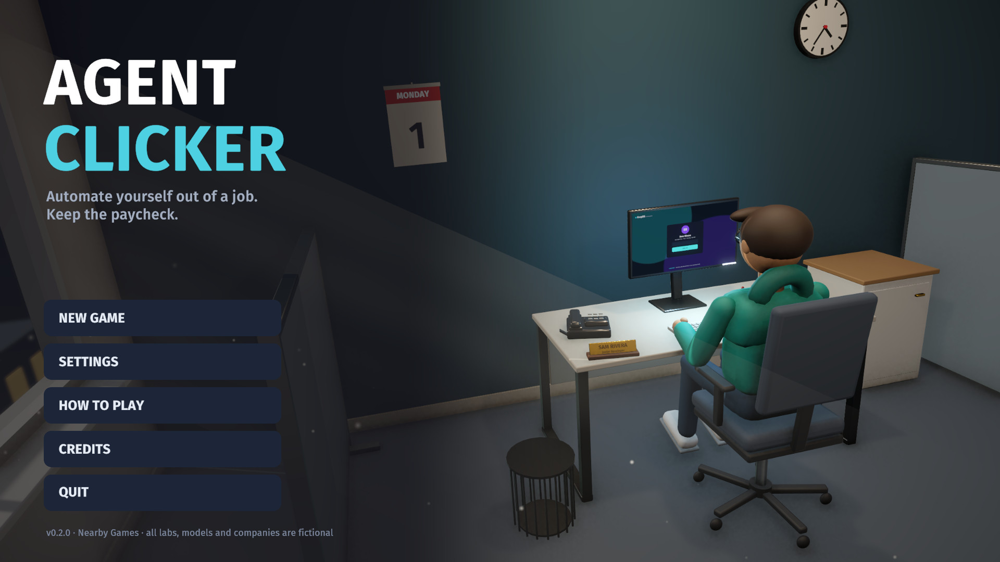 |  |
|  |  |
|  |  |
|  |  |
| 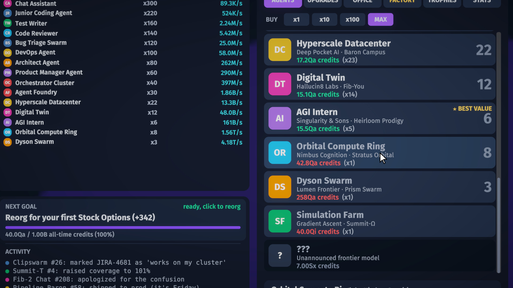 |  |

## Play it

Download the latest build from the [**Releases**](https://github.com/nearbycoder/AgentClicker/releases/latest) page.

**Linux (x86_64).** Unzip the Linux zip and run `./AgentClicker.sh`. The launcher starts the game with Unity's
native Wayland backend on a Wayland desktop, because the X11 path can hang at startup under XWayland (set
`AGENTCLICKER_X11=1` to skip that). The v0.1.0 zip predates the launcher: run
`./AgentClicker.x86_64 -force-wayland` there. Command-line options: `-reset` wipes the save and `-daylength 120`
shortens the work day (seconds).

**macOS (experimental).** `AgentClicker-v0.1.0-macos-universal.zip` is a universal (Intel and Apple Silicon)
build made on Linux. It is unsigned and hasn't been tested on a Mac. If macOS refuses to open it, run
`xattr -cr "Agent Clicker.app"` and then `codesign --force --deep -s - "Agent Clicker.app"`.

**In a browser (local build, not hosted yet).** `Tools/unity.sh build-webgl` makes a browser build in
`Builds/WebGL`, about 15 MB to download. Serve the folder with any static web server, for example
`python3 -m http.server -d Builds/WebGL 8000`, and open <http://localhost:8000>. The save goes to the
browser's storage (IndexedDB) and survives a reload. Browsers pause a tab you aren't looking at, so time in a
hidden tab counts like time with the game closed. It has only been tried in headless Chrome on Linux; see the
known issues below.

Saves live in `~/.config/unity3d/Nearby Games/Agent Clicker/` on Linux (Unity's `persistentDataPath`), and
settings are stored separately in PlayerPrefs. Each save replaces `agentclicker_save.json` in one step and keeps
the previous one as `agentclicker_save.json.bak`; if the main file is ever missing or damaged, the game loads
the newest readable copy instead.

## Build from source

You need **Unity 6000.6.2f1** with Linux Build Support (Mono), plus Mac Build Support (Mono) for macOS builds and
WebGL Build Support for the browser build. To
regenerate the art you also need **Blender 4.5 LTS**. The Unity project lives in [`Unity/`](Unity): open that
folder in Unity Hub, or drive everything headless with the helper scripts below. `Tools/unity.sh` expects the
editor at `~/Unity/Hub/Editor/6000.6.2f1/Editor/Unity`, or set `UNITY_EDITOR` to its path.

```sh
Tools/unity.sh setup       # URP, post-processing, player settings, reimport models (idempotent)
Tools/unity.sh scene       # regenerate Assets/Scenes/Main.unity from the models (the scene is committed)
Tools/unity.sh tests       # 106 EditMode tests, including the economy balance simulation
Tools/unity.sh build       # Linux player → Builds/Linux
Tools/unity.sh build-mac   # universal macOS player → Builds/Mac
Tools/unity.sh build-webgl # browser build (Brotli, works on any static host) → Builds/WebGL
Tools/play.sh              # run the Linux build (adds -force-wayland on Wayland)
Tools/package.sh v0.2.0    # release zips from the builds above → Builds/Release (Linux zip includes AgentClicker.sh)
```

**Art.** Every model is built from primitives by Python scripts and exported as FBX straight into the Unity
project:

```sh
blender -b --factory-startup -P Blender/scripts/build_all.py                # all models
blender -b --factory-startup -P Blender/scripts/build_all.py -- mug duck    # just these
blender -b --factory-startup -P Blender/scripts/build_all.py -- --preview   # plus preview renders
```

**Audio.** There's nothing to regenerate: the game ships with zero audio files. Sound effects, the office
ambience and the lo-fi music loop are synthesised when the game starts (`Unity/Assets/Scripts/Util/Sfx.cs`).

**Balance.** `Tools/unity.sh tests` fails if a greedy bot finishes the first Factory in under 1.5 or over 5
hours, or if later divisions aren't clearly faster than the first. For a ten-division career report, run
`Tools/unity.sh exec AgentClicker.EditorTools.BalanceReport.Career`.

**Media.** The trailer, the teaser loop and the screenshots in `docs/media` are made from the running game:

```sh
Tools/make_trailer.sh          # record every shot with the scripted director, then edit (needs ffmpeg, python3)
Tools/make_trailer.sh --edit   # re-edit from Recordings/trailer without recording again
Tools/tour.sh                  # screenshot tour of every phase, for visual checks
Tools/benchmark.sh             # uncapped frame times, GC and render stats in a late-game office
```

## Project structure

```
Design/GDD.md                 game design document: economy, labs, upgrades, story, pacing
Blender/scripts/              procedural model sources (aclib.py helpers, build_all.py, assets/*.py)
Blender/source/*.blend        the generated .blend files, for opening in Blender
Unity/Assets/Art/Models/      FBX output from Blender (+ employee.anim.json clip ranges)
Unity/Assets/Scripts/Core/    pure C# game model: economy, day cycle, calls, asks, story, career, save, balance sim
Unity/Assets/Scripts/Office/  the 3D office: props, camera rig, employee animation, lighting
Unity/Assets/Scripts/UI/      CorpOS, store, inbox, calls, menus and overlays, all built from code
Unity/Assets/Scripts/Util/    synthesised audio, settings, benchmark, screenshot tour, demo/trailer directors, video capture
Unity/Assets/Editor/          import pipeline, project setup, scene builder, build script, balance report
Unity/Assets/Tests/EditMode/  model, interruption, endless-game and balance tests
Tools/                        unity.sh, play.sh, tour.sh, benchmark.sh, record.sh, make_trailer.sh/.py
docs/media/                   trailer, teaser loop, poster and screenshots
```

## Tech highlights

* **Everything is generated from code.** Blender scripts build all 46 models from primitives. Material names
  carry meaning (`EMIT_*` glows, `GLASS_*` is transparent, `METAL_*` / `GLOSS_*` / `MATTE_*` set the surface,
  `Screen` marks a monitor), and `ModelImportPipeline.cs` turns them into URP materials on import. An editor
  script builds the scene, and the whole UI is constructed at runtime with uGUI and TextMesh Pro.
* **A rigged, animated employee** made of rigid bone-parented parts. Ten animations (typing, sipping, stretching,
  facepalming, feet up and more) are baked on one timeline and split into clips by the importer. Typing speed
  follows your click rate.
* **The economy is a plain C# model** (`GameModel`) with no Unity dependencies, covered by EditMode tests.
  `BalanceSimulator` plays the game greedily to keep pacing in range, and all money math saturates at the
  largest double, so huge numbers can't turn into NaN or Infinity in a save.
* **Procedural audio.** Key clicks, chimes, the phone ring, the office hum and a 76 BPM lo-fi loop (Rhodes
  chords, bass, plucked melody, swung drums) are synthesised on a worker thread at startup.
* **Performance work** for a game that idles in the background: nested canvases so a ticking number only
  rebuilds its own batch, pooled floating numbers faded with CanvasGroups, prewarmed font atlases,
  on-demand reflection probes, and a 15 fps cap when the window is unfocused. A late-game office runs at about
  1.7 ms of main-thread CPU at 60 fps while clicking 15 times a second.
* **A scripted trailer director.** `-trailer` mode plays a shot list with an on-screen cursor that clicks real
  UI through Input System events. `VideoCapture` locks time to a fixed 30 fps step, pipes frames to ffmpeg and
  records the game's own audio with `AudioRenderer`. `Tools/make_trailer.py` then cuts the shots, adds the
  captions and title cards, and lays the game's music under the sound effects.

## Credits

Made by [nearbycoder](https://github.com/nearbycoder) (Nearby Games). Every model, sound and line of text was
generated or written for this game.

* Fonts: [Fira Sans](https://github.com/mozilla/Fira) (SIL OFL 1.1) and [DejaVu Sans Mono](https://dejavu-fonts.github.io)
  (Bitstream Vera license), plus Liberation Sans (SIL OFL 1.1) from TextMesh Pro's essential resources.
* Built with [Unity 6](https://unity.com) and the Universal Render Pipeline. Models made with
  [Blender](https://www.blender.org). Trailer edited with [FFmpeg](https://ffmpeg.org) and
  [Pillow](https://python-pillow.org). Developed with [Claude Code](https://claude.com/claude-code).
* Full details are in [THIRD_PARTY_NOTICES.md](THIRD_PARTY_NOTICES.md). Every lab, AI model, company and person
  in the game is fictional.

## Status and known issues

Agent Clicker is complete and playable from the first click to the endless game. This is the first public
release (v0.1.0).

* **Tested on Linux only**: CachyOS with KDE Plasma on Wayland and an AMD Radeon 8060S. Other distributions
  and GPUs should work but haven't been tried.
* **XWayland hang**: the Linux player can hang at startup through XWayland. Launch with `-force-wayland`
  (the `AgentClicker.sh` launcher in zips made by `Tools/package.sh`, and `Tools/play.sh`, do this for you).
* **One unexplained crash**: in October 2026 the Linux player crashed once (SIGSEGV on a native worker thread,
  no managed code on the stack) during an automated screenshot tour, while the machine was badly overloaded.
  Four further runs of the same build were clean. It hasn't been reproduced or explained.
* **macOS is experimental**: the build is made on Linux, isn't signed or notarised, and hasn't been run on a Mac.
* **The browser build is new and lightly tested**: it was checked in headless Chrome on Linux only (start a game,
  autopilot login, save, reload, continue). Firefox, Safari, phones and tablets (there's no touch support) and
  long sessions haven't been tried, and it isn't hosted anywhere yet. Music starts a few seconds after loading
  because it's synthesised on the page's only thread.
* **No Windows build yet.** The build script has a Windows target, but it hasn't been built or tested.
* **Mouse and keyboard only**, English only.
* **Pacing is tuned by a bot.** The balance tests keep the first Factory between 1.5 and 5 hours for a greedy
  bot; real players will vary.
* **The trailer and screenshots** come from the scripted `-trailer` mode, which jumps between prepared save
  states to reach each moment. Everything on screen is rendered by the game itself; nothing is mocked up.
* **No license has been chosen yet.** Until one is added, all rights are reserved.
