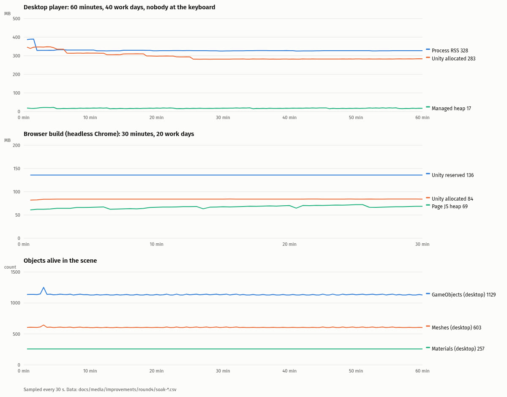
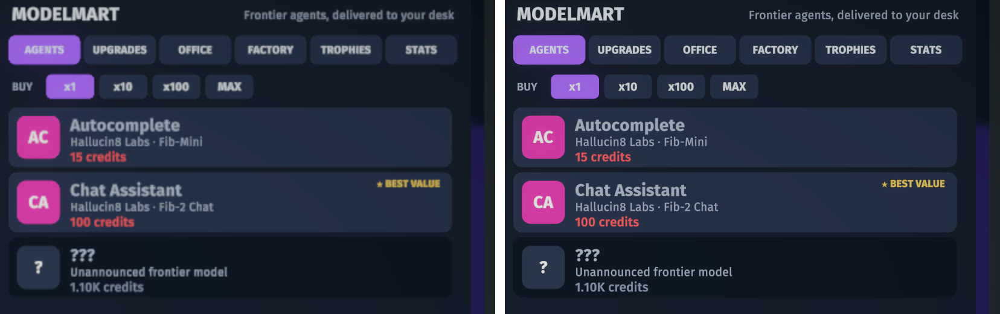
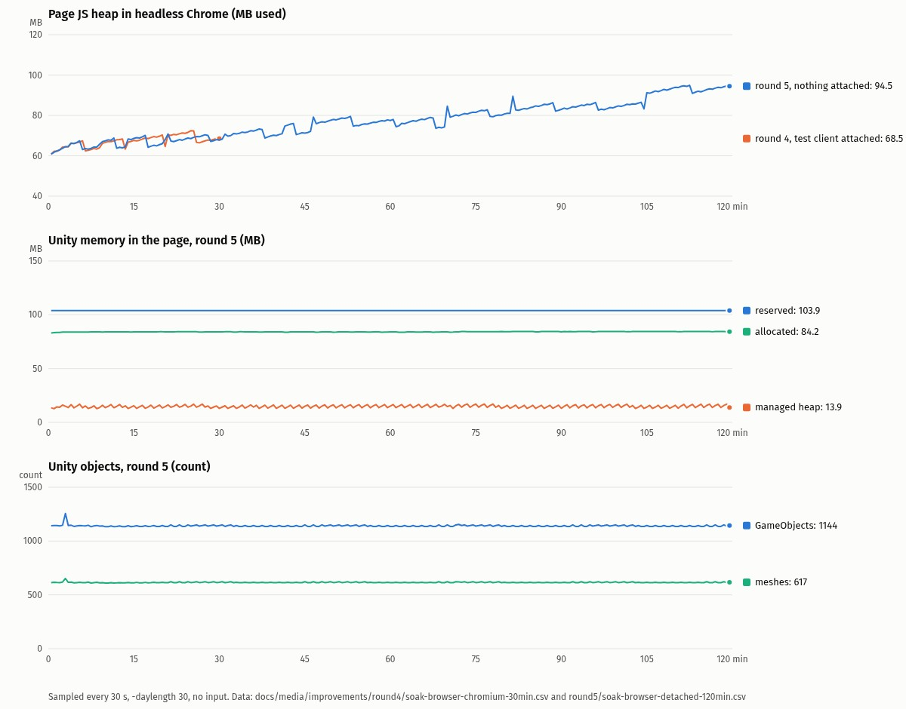
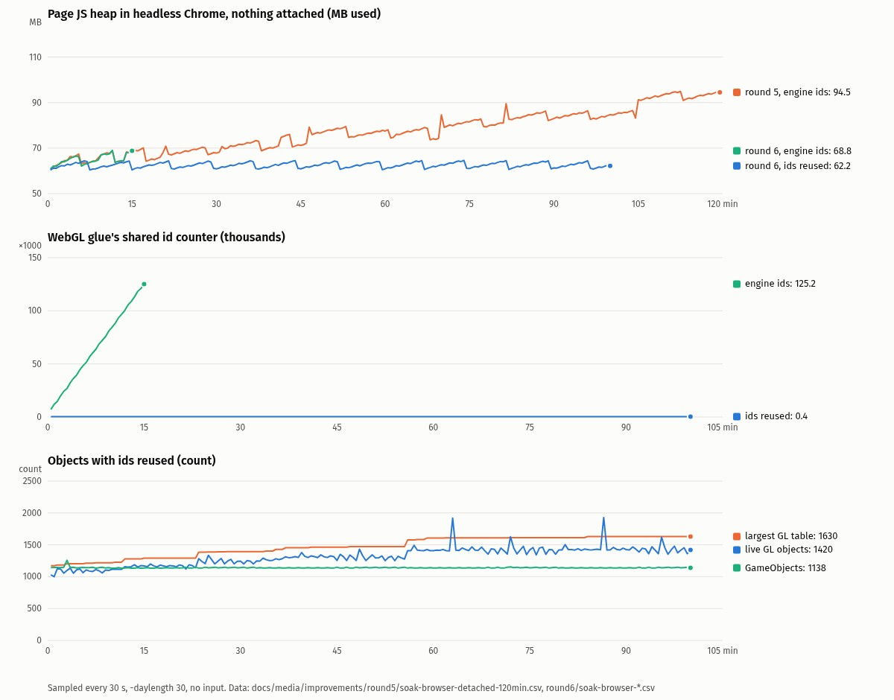
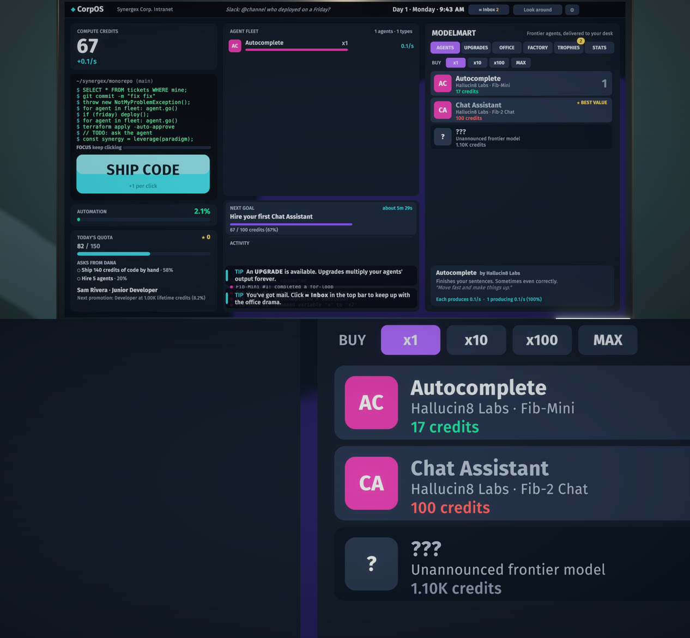
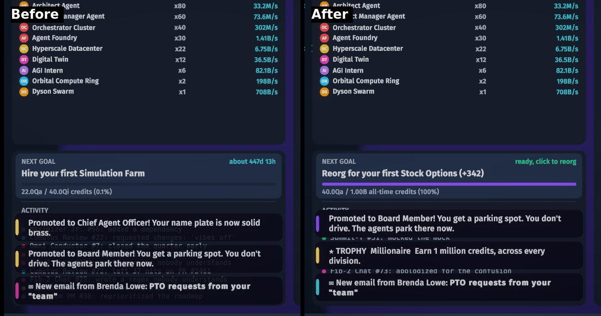
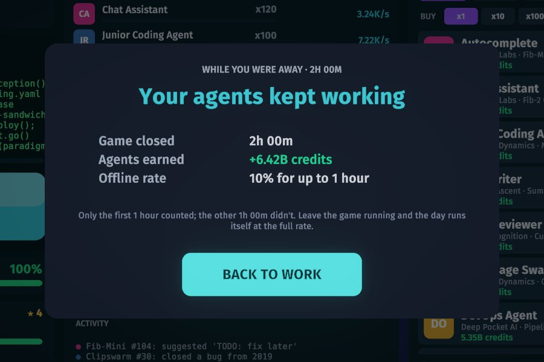
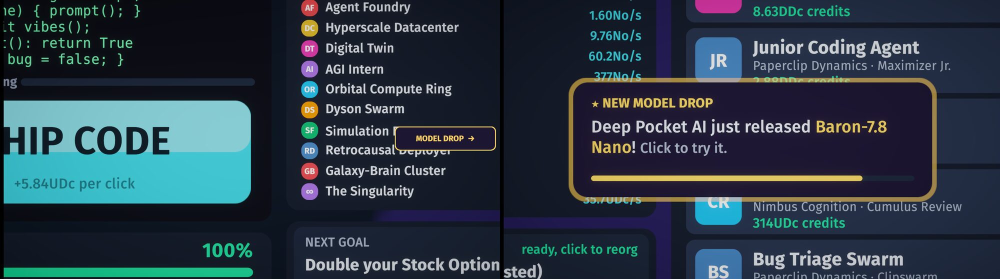

# Agent Clicker: improvement plan

Written on 2026-10-06, after v0.1.0 (published 2026-10-04). This document ranks what would most raise the
game's quality for a real player, then records each round's scope and results. Rounds 1–7 (branches
`improvements` to `improvements-7`) are merged into `main`; round 8 is on `improvements-8`.

## Baseline (what was run, and what it showed)

| Check | Result |
|---|---|
| `Tools/unity.sh tests` (EditMode) | **96/96 passed.** Balance bot: first Factory in **2h 09m** (day 27), inside the 1.5–5 h band. Career check: Marketing 59m, Sales 47m, Legal 47m. |
| `Tools/unity.sh build` (Linux, release) | **Succeeded**, 109 MB, 0 errors. |
| `Tools/tour.sh` (built player, `-force-wayland`) | **42 screenshots, no exceptions** in the player log. Every phase renders: title, settings, intro, login, day 1, calls, mid/late game, outage, review, night, Factory, ending, epilogue, endless, reorg, Board Room, trophies. |
| WebGL feasibility build (throwaway copy of the project in `~/.cache`, repo untouched) | **Builds with no code changes**: 7 min, 0 errors, **15 MB** download (Brotli). In headless Chrome on this iGPU it reaches the title screen and the day 1 office at **60 fps** (vsync-capped). Two problems: post-processing is off in the browser, and **the save did not survive a page reload**. Details below. |
| `Tools/benchmark.sh` | Not re-run. The machine is shared (load average 25–35 during this session), so frame times wouldn't be comparable with the README's 1.7 ms figure. |
| Windows build | Not possible here: Windows Build Support isn't installed. |
| macOS build | Not rebuilt; it has never been run on a Mac and can't be verified on this machine. |

The game is complete, stable and well tested at the model level. The gaps below are about how it
behaves for a real player (especially an *idle* player), where it can be played, and a few rough edges.

## Findings that drive the ranking

1. **The idle game stops when you go idle.** `GameModel.Tick` only produces while
   `Phase == Working`. At 17:00 the game asks you to clock out; if nobody answers, Sam works overtime
   until 23:30 and is then clocked out automatically into the performance review, a modal with a single
   GO HOME button (`ComputerUI.ShowReview`, `dismissable: false`). From then on **nothing is produced**
   until the player clicks GO HOME, then CLOCK IN on the night screen, then the monitor to log in. With
   the default 5-minute day that is about **9 minutes of production per check-in**: a player who leaves
   the game open and checks back every 30 minutes earns roughly 30% of what the game promises, every
   hour about 15%. The night shift is worth 60 s of production and the offline rate is 10% for at most
   one hour. The pitch is "your agents do the whole job"; the agents currently need Sam to press three
   buttons every nine minutes. The balance bot never sees this: it clocks out and back in instantly.
2. **Platform reach is Linux plus an untested Mac build.** The blog lists Windows · macOS · Linux.
   Windows needs a Unity module the owner has to install. A browser build is the cheapest way to reach
   everyone (see the WebGL notes below), and idle clickers are traditionally browser games.
3. **The Linux build hangs at startup under XWayland** unless it's started with `-force-wayland`.
   `Tools/play.sh` handles that for developers, but a player who unzips the release and double-clicks
   `AgentClicker.x86_64` on a Wayland desktop gets a hang: the published v0.1.0 zip contains only the
   player files, no launcher. Release zips are also packed by hand (the machine has no `zip`; `bsdtar`
   was used), so there's no reproducible packaging step.
4. **Saving is not crash-safe.** `SaveSystem.Save` writes `save.json.tmp`, then *deletes* `save.json`,
   then moves the temp file into place. A crash or power loss between the delete and the move leaves
   no save, and `Load` never looks at the `.tmp` file, so a 20-hour career would silently restart.
   There's also no backup copy if the JSON is ever corrupted.
5. **Screen traffic at busy moments.** In the tour's mid-game shot (day 4) a chapter banner, a model
   drop card and three toasts are on screen at once: the banner covers SHIP CODE, the drop card covers
   the store's buy-mode row, and the toast stack covers the store's info panel and the quota panel.
6. **Small onboarding and help gaps.** On day 1 the player dismisses three intro cards and a day card,
   clicks the monitor, and then the CEO's mandate email auto-opens over the desktop before the first
   SHIP CODE click, repeating what the intro cards just said. The in-game Controls tab omits the phone
   keys (`E`/`Q`, `1`/`2`/`3`) that the README lists.
7. **Pacing has two long stretches without a new agent type** in the bot's run: Architect (24m) →
   Product Manager (54m), and first Orchestrator (1h 10m) → Factory (2h 09m). Upgrades, gadgets and
   promotions land in between, so this is a watch item rather than a defect.
8. **The game reports the wrong version.** `bundleVersion` is `1.0`, so the title screen says "v1.0"
   while the release is v0.1.0.
9. **Docs drift.** GDD §9 says the bot takes "about 2.5 hours (around 31 in-game days)"; §16, the
   README and today's test run say 2h 09m / day 27. The GDD's career table (Marketing 26m) uses
   one-hour laps; the test's report uses shorter laps (Marketing 59m). Both are fine, but unlabeled.

## Ranked improvements

Impact is for a real player. Effort: S (≤ half a day), M (about a day), L (several days).

| # | Improvement | Impact | Effort | Risk |
|---|---|---|---|---|
| 1 | **Idle-friendly day cycle.** When nobody is at the keyboard, the day runs itself: clock out at 17:00, file the review, go home and clock back in the next morning, with a short toast so the player sees what happened. A Gameplay setting turns it off. | High: fixes the core idle promise | M | Low–medium: must not fight active players or story moments |
| 2 | **Browser (WebGL) build.** A `build-webgl` target, browser-safe code paths (music synthesis without a worker thread, saves flushed to IndexedDB, desktop-only settings hidden, no Quit button), and a page that can go on itch.io. | High: reach | M | Medium: browser performance on integrated GPUs, URP/WebGL2 limits |
| 3 | **Reproducible release packaging with a Linux launcher.** `Tools/package.sh` builds the zips (Linux, Mac, WebGL) with `bsdtar`, leaves out the `_BackUpThisFolder` debug folder (as the hand-made v0.1.0 zip did), and adds an `AgentClicker.sh` launcher that passes `-force-wayland` on Wayland. | Medium–high: first launch on Linux | S | Low |
| 4 | **Crash-safe saves.** Atomic replace, a `.bak` of the previous save, and a load fallback to `.bak`/`.tmp` when the main file is missing or unreadable. | Medium (rare, but catastrophic for an idle game) | S | Low |
| 5 | **Busy-screen polish.** Hold chapter banners while a modal, drop card or call is up; move the toast stack off the store and quota panels; complete the Controls tab; on day 1, let the player ship a few lines of code before the CEO's mail opens. | Medium | S–M | Low |
| 6 | **Windows build.** The build script already has a Windows target; it needs Windows Build Support (Mono) installed in Unity Hub. It could be built here but not tested on Windows. | High: reach | S once the module exists | Medium: untested platform. **Blocked on the owner.** |
| 7 | **Offline earnings review.** 10% for at most 1 hour is stingy for the genre once #1 lands; consider 2–4 hours, and show what the cap is earlier. A balance decision for the owner. | Medium | S | Medium: interacts with the Remote Work / Unlimited PTO perks |
| 8 | **Reduce motion option.** One toggle for the camera dollies, button punches and floating numbers (the showcase camera already has its own toggle). | Low–medium (accessibility) | S–M | Low |
| 9 | **Mid-game pacing goals.** *(Done in round 3 as the next goal card.)* Make the two long stretches visible goals (for example a "next unlock" line with progress), rather than rebalancing. | Medium | M | Medium: balance tests constrain it |
| 10 | **Gamepad / Steam Deck support.** The UI is built from code with uGUI buttons; it would need explicit navigation and focus visuals. | Medium | L | Medium |
| 11 | **Version and docs cleanup**: set `bundleVersion` to match the release (findings 8, 9). | Low | S | None |
| 12 | **macOS verification.** Needs someone with a Mac (Apple Silicon and Intel) to run the build; signing and notarisation need an Apple Developer account. **Blocked on the owner.** | Medium | S–M | — |
| 13 | **Localization.** All text is in code as C# strings; extracting it is a large job. | Medium | L | Medium |

## WebGL assessment

**Viable and worth it.** The unmodified project builds for WebGL (the module is installed), the
download is 15 MB against 109 MB for the Linux player, and the first minutes run at 60 fps in Chrome on
this machine's Radeon 8060S (ANGLE on Vulkan). An idle clicker is the kind of game people play in a
browser tab, so this is the cheapest platform reach available. It needs these fixes:

* **Saves.** After a new game, 20 s at the login screen (autosave runs every 15 s) and a reload, the
  title screen offered no CONTINUE, so the save did not persist. The likely cause is that
  `persistentDataPath` lives in IndexedDB and isn't flushed after `File.WriteAllText`; this still needs
  confirming. A browser player who loses their career on reload would never come back, so this blocks
  shipping.
* ~~**Post-processing is off.**~~ *Corrected in round 1:* the console warning about the FSR upscaling shader
  is generic. In this URP version an unsupported FSR shader only disables the FSR pass itself
  (`Fsr1UpscalePostProcessPass`), and a side-by-side of the title screen shows the same grading and vignette
  in the browser as on desktop. No fix was needed.
* **Music.** `Sfx` renders the lo-fi loop with `Task.Run`. WebGL has no worker threads, so the loop
  probably never finishes or blocks the main thread. Unverified: headless Chrome can't tell us what
  was audible. The fix is to render it in slices from a coroutine on WebGL.
* **Desktop-only settings and buttons**: display mode, resolution list, V-Sync, frame cap, QUIT and the
  F12 screenshot do nothing useful in a browser and should be hidden there.
* **Not tested**: Firefox and Safari, phones and tablets (the game has no touch support, so mobile would
  be marked unsupported), lower-end GPUs, and long sessions (memory growth).

Windows, by contrast, is a one-line build once the module is installed, but this machine can't verify
it. The browser build can be verified end to end here.

## Round 1 scope

Five items, in order. Windows (#6) and macOS (#12) wait for the owner.

### 1. Idle-friendly day cycle (#1)

* A pure C# policy (`Core/DayAutopilot.cs`) decides what to do from the phase, seconds since the last
  player input and whether a modal, call or story card is up. `GameManager` feeds it real input times
  (any key, click, wheel or mouse movement) and performs the action through the same methods the
  buttons call.
* Defaults: at 17:00 with no input for 30 s, clock out; review shown and idle for 15 s, go home; night
  screen idle for 8 s, clock in; login idle for 10 s, log in. Never during the intro, the ending, the
  reorg memo, a ringing or active call, the pause menu or settings. Any input cancels the countdown.
* Setting: Gameplay → "Run the work day when I'm away" (on by default). A toast tells the player what
  happened ("Your agents clocked you out and back in. Day 12 is underway.").

**Acceptance criteria**
* With the setting on and no input, a game left running for one hour produces in every day (no phase
  other than Working lasts longer than about 20 s).
* With the setting off, behaviour is identical to v0.1.0.
* An active player who keeps clicking never sees an automatic action.
* The balance tests still pass unchanged.

**Verification**: new EditMode tests for the policy (each phase, each blocker, input resets the
timer) and a simulated hour with no input that checks earnings in every day; a run of the built player
with `-daylength 30` left alone for a few minutes, checking the log and screenshots for automatic
clock-outs and clock-ins.

### 2. Crash-safe saves (#4)

* Save writes the temp file, then `File.Replace` (keeping `agentclicker_save.json.bak`), with a
  fallback to copy-then-delete where `Replace` isn't available (WebGL).
* Load tries the main file, then `.bak`, then `.tmp`, and logs which one it used.

**Acceptance criteria**: a missing main file with a valid `.bak` or `.tmp` loads; a corrupt main file
falls back to `.bak`; a normal save leaves the main file and one backup.
**Verification**: EditMode tests against a temporary save folder (the save folder becomes
overridable for tests).

### 3. Browser build (#2)

* `Tools/unity.sh build-webgl` → `Builds/WebGL`, Brotli with decompression fallback so it works on
  any static host.
* Browser-safe paths behind `#if UNITY_WEBGL`: music synthesised incrementally on the main thread
  instead of `Task.Run`; save writes followed by an IndexedDB flush; display mode, resolution, V-Sync,
  frame cap and Quit hidden; F12 screenshots disabled; a lighter default quality preset.
* Bilinear upscaling instead of FSR on WebGL, so post-processing runs in the browser.
* README: a "Play in the browser" section with honest caveats (tested browsers, performance).

**Acceptance criteria**: the build loads in a browser served from `localhost`, reaches the title
screen, starts a new game, logs in, clicks SHIP CODE and hires an agent; the save survives a page
reload (CONTINUE appears and restores the credits); the console has no exceptions and no "post
processing will not execute" warning; the music clip is created (logged), even though headless Chrome
can't confirm that it's audible.
**Verification**: serve `Builds/WebGL` with `python3 -m http.server` and drive it with Playwright and
headless Chrome (as in this phase's spike), capturing screenshots and console logs. Frame rate is
measured in that browser on this iGPU and reported as-is.

### 4. Release packaging with a Linux launcher (#3)

* `Tools/package.sh [version]` zips Linux, Mac and (if built) WebGL into `Builds/Release/` with
  `bsdtar`, excluding `*_BackUpThisFolder_ButDontShipItWithYourGame`.
* The Linux zip gets `AgentClicker.sh`, which adds `-force-wayland` when `WAYLAND_DISPLAY` is set and
  passes other arguments through. README "Play it" points to it.

**Acceptance criteria**: zips contain no backup folders; `AgentClicker.sh` from the unpacked zip starts
the game on this Wayland desktop without extra flags.
**Verification**: list the zip contents; unpack to a temp folder and run the launcher with a tour
argument (`-tour`) to confirm it reaches the title screen and writes screenshots.

### 5. Busy-screen polish (#5)

* Chapter banners wait until no modal, drop card or call is showing.
* The toast stack moves to the left of the store column so it no longer covers the store info panel.
* The Controls tab lists the phone keys.
* `bundleVersion` matches the release, so the title screen stops saying "v1.0".
* Day 1: the CEO's mandate email is delivered after the first 10 clicks of SHIP CODE (the intro cards
  already carry the mandate), so the player's first action is shipping code. Dana's follow-up, which
  arrives at 15 clicks today, moves back accordingly.

**Acceptance criteria**: in the tour's mid-game shot, banner, drop card and toasts don't overlap each
other or the SHIP CODE button; the Controls tab shows `E`/`Q` and `1`/`2`/`3`; on a fresh game the
first modal after login appears only after 10 clicks.
**Verification**: re-run `Tools/tour.sh` and compare the affected screenshots with the baseline; an
EditMode test for the mail trigger.

## Needs a decision from the owner

* **Windows**: install Windows Build Support (Mono) for 6000.6.2f1 in Unity Hub
  (`unityhub --headless install-modules --version 6000.6.2f1 -m windows-mono`) if a Windows zip is
  wanted. It would ship as untested, like the Mac build.
* **Where the browser build lives**: itch.io, GitHub Pages or the nearbycoder.com page. This round only
  produces the build; publishing is the owner's call.
* **Offline earnings (#7)**: keep 10% / 1 hour, or raise the cap once the day runs itself.
* **License**: still none, which matters more once the game is on a public web page.

## Round 1 results (2026-10-06)

All five scoped items landed on `improvements`, one commit each. Tests: **106/106** (96 at baseline). Screenshots
are in [`docs/media/improvements/`](media/improvements).

| Item | Commit | Verified by |
|---|---|---|
| 1. Idle-friendly day cycle | `0500405` | 5 EditMode tests (an idle hour produces in every day; input, blockers and WORK LATE hold it); a new autopilot segment in `Tools/tour.sh` logs PASS for clock-out, go home, clock-in and log-in in the built player |
| 2. Crash-safe saves | `6ac68df` | 4 EditMode tests against a temp folder (backup kept, corrupt and missing main file recover, delete removes every copy) |
| 3. Browser build | `7d72a4e` | `Tools/unity.sh build-webgl` (14 MB). Headless Chrome + Playwright on a local server: title without QUIT, new game, autopilot login, music ready after ~5–8 s, SHIP CODE, the save in IndexedDB before and after a reload (credits 61.46), CONTINUE restores it. 60 fps on this iGPU when the machine was quiet, 5–30 fps at load average 60–90 |
| 4. Packaging + Linux launcher | `bd80297` | `Tools/package.sh` zip listings (no do-not-ship folders, exec bits kept); the launcher from an unpacked zip chose the Wayland backend and ran the tour |
| 5. Busy-screen polish | `099f157` | New EditMode test for the day-1 mail rule; tour before/after shots; the browser run shows no inbox after login and the CEO's mail after the first clicks |

Changes from the plan:
* Day 1 mail: the CEO's email is still *delivered* first (tests and the trailer depend on that); what waits
  for 10 clicks is the inbox *auto-opening*. Dana's email didn't need to move.
* The chapter banner also moved to the upper part of the screen, so it no longer covers SHIP CODE even when it
  starts before a model drop appears (as in the tour's mid-game shot).
* A frame gap of over a minute (hidden browser tab, laptop sleep) is now credited like time away with the game
  closed, on every platform. Browsers stop running hidden tabs, so without this a browser idle game would lose
  that time.

Open:
* **One native crash.** A SIGSEGV on a Unity worker thread (no managed frames) ended one of five tour runs
  of the item-1 build while the machine was at load average 70–90. The other four runs were clean, and it
  hasn't been reproduced or explained. Worth running the tour a few more times on the development build
  (`Builds/LinuxDev`, with symbols) on a quiet machine.
* Not verified: Firefox and Safari, audible audio in the browser (headless), the macOS build (no Mac), Windows
  (module not installed), and save crash-safety in a real power cut (only simulated in tests).
* Still owner decisions: Windows Build Support, hosting the browser build, the offline-earnings cap, a license,
  and release versioning (the project now says 0.2.0; nothing is tagged or released).

## Round 2 scope

Picked from the ranked list (#8, plus small parts of #9 and #11) and from what round 1 turned up. Balance stays
as it is (the offline cap of 10% for 1 hour is an owner decision), and so do Windows, hosting and gamepad
support (L effort).

### 1. "While you were away" report

Round 1 made the day run itself, but a returning player only sees the last toast ("Day 24"). They can't tell
how many days passed, what was earned, whether the quota was met, or which calls and model drops were missed.

* A pure C# `AwayReport` (in `Core`) starts with the autopilot's first action and collects: days worked, credits
  earned, quotas met and missed, stars, missed calls and expired model drops.
* On the first input after the autopilot has run at least one full day, CorpOS shows a dismissable
  "WHILE YOU WERE AWAY" card with those numbers. Shorter absences keep today's toast.

**Acceptance**: after an idle stretch of several days, the card lists the right day count and earnings; it
appears once, on return, and never for an active player. **Verify**: EditMode tests (an idle hour driven by the
autopilot, then the report's numbers checked against the model), plus a tour segment that idles through a
day, simulates input, and logs PASS when the card shows (screenshot).

### 2. Reduce motion (#8)

* Settings → Gameplay → "Reduce motion" (off by default). Camera moves cut instead of flying (log-in dolly,
  calls, view toggle, ending); gadget showcases are skipped; the title camera holds still; button punches,
  pulses and the rising floating numbers stop moving (the numbers fade in place).

**Acceptance**: with the option on, a camera mode change lands on its target in the next frame, and no pulse or
punch changes scale. With it off, nothing changes. **Verify**: a tour segment that switches the camera with
reduce motion on and logs PASS if it has reached the target one frame later, a screenshot of the setting, and
the existing tour unchanged with the option off.

### 3. A hosting-ready browser page

Round 1's browser build uses Unity's default page: a fixed 1280×720 box with a "Unity Web Player" title.

* A project WebGL template (`Assets/WebGLTemplates/AgentClicker`): the canvas fills the window, the page title
  and colours match the game, a progress bar while loading, a fullscreen button, and a short notice on touch
  devices ("needs a mouse and keyboard").

**Acceptance**: at 1280×720, 1920×1080 and a phone-sized viewport the canvas fills the page with no scrollbars;
the title reads "Agent Clicker"; the touch notice appears only on touch devices; the game still saves and
continues across a reload. **Verify**: Playwright and headless Chrome against a local server (port chosen
free, output in `Logs/`), screenshots at each size.

### 4. Polish: model drop placement and number drift (#11)

* Model drop cards spawn in a band that can't overlap the chapter banner or the toast stack.
* GDD §9 and the career table quote today's numbers (2h 09m, day 27) and say which lap length they use.

**Acceptance**: drop positions are always inside the band (an EditMode test over many spawns via a pure helper);
the docs agree with `Tools/unity.sh tests` output.

### 5. Hunt the Linux segfault (time-boxed)

Round 1 saw one native crash in five tour runs under heavy load. Run the tour repeatedly on a quiet machine
(release build), then on the development build if it reproduces, and record the outcome honestly. If it doesn't
reproduce, the README keeps the note with the new run count.

**Acceptance**: a recorded run count and outcome; a fix only if the cause is found.

Whole round: `Tools/unity.sh tests` (including the balance simulation) passes, the tour passes, and screenshots
go to `docs/media/improvements/round2/`.

## Round 2 results (2026-10-06)

All five items landed on `improvements-2`, one commit each after the plan (`e4f2936`). Tests: **110/110**
(106 after round 1), balance bot unchanged at 2h 09m. Screenshots are in
[`docs/media/improvements/round2/`](media/improvements/round2).

| Item | Commit | Verified by |
|---|---|---|
| 1. "While you were away" report | `144f7c2` | 3 EditMode tests (an idle hour driven by the autopilot is reported with the right days, quotas, missed calls and earnings, and only once; an active player and a break without an end of day get nothing); the tour shows the card on return (`away_report.jpg`, with the threshold lowered to 3 s for the tour) |
| 2. Reduce motion | `79d05ed` | Tour check against a control run: normal motion leaves the camera 2.3 m off two frames into a move and 3 pulsing elements moving; with reduce motion it's 0 m and none move. Setting screenshot. With the option off the rest of the tour is unchanged |
| 3. Hosting-ready browser page | `7c1b260` | Headless Chrome at 1280×720, 1920×1080 and a 390×844 touch phone: canvas = viewport, no scrollbars, title "Agent Clicker", touch notice only on the phone, no page errors; save → reload → CONTINUE restored the career; 52 fps at load ~20 |
| 4. Drop placement + GDD numbers | `1320d02` | EditMode test over 2,000 spawns (below the banner, above the toasts, right of SHIP CODE); career table re-run with `BalanceReport.Career`, still matching |
| 5. Linux segfault hunt | — (no code change) | 7 tours of the round-1 release build, 2 of the round-2 release build and 6 of a round-2 development build (with symbols): **15 runs, 0 crashes**, every check passing, at load averages 15–73. Not reproduced, so no fix; the README note now gives the run count |

Also measured: `Tools/benchmark.sh` A/B against the published v0.1.0 build in the same session. Both read
3.3–4.6 ms main-thread CPU at 60 fps and swing widely in allocations (276–1,638 B/frame for v0.1.0, 729–1,295 for
this build) as the machine's load changes. No measurable regression, but the README's 1.7 ms can't be reproduced
on the busy machine, so it now says so.

Also: `222e25d` moves the tour, benchmark and record scripts' default output from the shared `/tmp` to the
gitignored `Logs/`, and makes their paths absolute (the player resolves relative paths against its own folder).
Older `/tmp/agentclicker-*` files from October 4 are still on the machine; they predate this work and were left
alone.

Deferred, and why:
* Gamepad / Steam Deck (#10) and localization (#13): large jobs, not started.
* Mid-game pacing goals (#9): only the doc part was done; a "next unlock" tracker needs design and play testing
  against the balance band.
* Firefox, Safari, real phones, and audible browser audio still unverified (headless Chrome only).

Owner decisions (unchanged): Windows Build Support, browser hosting, the offline-earnings cap (kept at 10% for
1 hour), license, signing, releases and tags.

## Round 3 scope

Picked from what is still open after round 2: the deferred "next goal" tracker (#9, designed below), the
browser build's untested engines and audio, and two things a browser player needs before the build is hosted
anywhere. Gamepad (#10) and localization (#13) stay deferred (large), and so do the owner's decisions (Windows
Build Support, hosting, the offline cap of 10% for 1 hour, license, releases).

Supporting work, not a player item: `Tools/tour.sh` and `Tools/benchmark.sh` run the player with a throwaway
`XDG_CONFIG_HOME` under `Logs/`, so a tool run can't write Unity's own window and session prefs into the real
`~/.config/unity3d/Nearby Games/Agent Clicker/` (the game's save and settings were already kept out). Checked by
hashing that folder before and after the round.

### 1. A "next goal" card

Two stretches of the first Factory run go long without a new agent type (Architect → Product Manager about 30
minutes for the bot, the first Orchestrator → the Factory about an hour), and the Factory's checklist is only
visible on its own tab. The design:

* A pure C# `NextGoal` (in `Core`) picks one goal from the model, in this order. Before this division's Factory:
  the cheapest story agent type you don't own yet (each is revealed once the previous one is hired), then the
  Orchestrator Clusters the Factory needs, then the Zero-Gravity Recliner, then the Factory's price. After it:
  the next frontier agent type you don't own, then the next vested Stock Option (with the reorg). Each goal has
  a title, what you have, what you need, and an estimate at the current rate.
* CorpOS shows it as a small card at the top of the ACTIVITY panel (which is empty above the log): "NEXT GOAL",
  the title, a progress bar and "1.1B / 2.4B · about 6m". Clicking it opens the store tab where the goal is
  bought.
* No balance change: the goal only displays what the store and Factory tab already know.
* The same "about 6m at your current rate" estimate is added to the store's hover info for agents, upgrades and
  gadgets you can't afford yet.

**Acceptance**: the goal follows the order above at every stage (fresh game, mid game, every Factory
requirement, after the Factory, after all frontier agents); progress is always between 0 and 1; along a full
bot run to the first Factory there is always a goal, and every goal the bot sees is eventually met. The balance
test is unchanged. **Verify**: EditMode tests for each stage and one that walks the `BalanceSimulator` run;
tour screenshots of the card early, mid, late and after the Factory, and a tour check that clicking it opens
the right tab.

### 2. The browser build in WebKit, with audio and save-on-hide checks

Rounds 1 and 2 only ran the browser build in headless Chrome, never checked that audio actually plays, and a
browser player who closes the tab can lose up to 15 seconds since the last autosave (including a big purchase).

* Run the build in Playwright's WebKit (the engine behind Safari; a Linux build of it, not Safari itself) as
  well as Chromium: load, new game, autopilot login, SHIP CODE, hire, save, reload, CONTINUE. Fix whatever
  breaks.
* An audio probe in the test page (an analyser on the page's `AudioContext`) measures whether the game's
  output is non-silent after the first click, in both engines.
* The page saves when it is hidden or closed (`visibilitychange` / `pagehide` → the game saves and flushes
  IndexedDB), so closing the tab right after buying keeps the purchase.

**Acceptance**: the full flow passes in both engines with no page errors; the audio probe reads a non-silent
signal after the first click in both (or the result is reported honestly if an engine can't be probed);
credits earned after the last autosave survive "hide the tab, reload". **Verify**: one Playwright script per
engine (output in `Logs/`), screenshots in `docs/media/improvements/round3/`.

### 3. Move a career between browsers and computers

A browser save lives in that browser's site storage: clearing site data, switching browsers or moving to the
desktop build loses the career, and there's no way to keep a copy.

* Settings → Gameplay gets a SAVE FILE row. In the browser: DOWNLOAD SAVE (the save JSON as
  `agentclicker_save.json`) and LOAD SAVE FILE (a file picker). On the desktop: OPEN SAVE FOLDER, since the
  same file can be copied in or out there. One format both ways, so a browser download works on the desktop and
  the other way round.
* A loaded file is checked (`SaveSystem.Validate`: parses, has a started career, day ≥ 1) and replaces the
  current career only after a confirmation that names both careers (division, day, credits).

**Acceptance**: a downloaded save loads into a fresh browser profile and continues with the same credits and
day; garbage, an empty file and a non-save JSON are rejected with a message and change nothing.
**Verify**: EditMode tests for `Validate`; Playwright: download, then a new browser context with empty
storage, LOAD SAVE FILE through the file chooser, CONTINUE, compare credits and day.

### 4. Help that matches the game

The How to Play card predates rounds 1–2: it doesn't mention that the day runs itself when you're away, the
"While you were away" card, daily asks, Focus draining, or the phone keys.

* Rewrite How to Play to cover those in the same space, and add the Settings → Gameplay options it refers to.

**Acceptance**: every mechanic in the README's "How to play" section is in the card, and it fits the card
without the auto-sizer shrinking it below its minimum. **Verify**: tour screenshot of the card.

Whole round: `Tools/unity.sh tests` (including the balance simulation) passes, the tour passes, the benchmark is
re-run and compared within the same session, screenshots go to `docs/media/improvements/round3/`.

## Round 3 results (2026-10-06)

All four items landed on `improvements-3`, one commit each after the plan (`077bd6a`) and the tool change
(`7486493`). Tests: **127/127** (110 after round 2), balance bot unchanged at 2h 09m. Screenshots are in
[`docs/media/improvements/round3/`](media/improvements/round3).

| Item | Commit | Verified by |
|---|---|---|
| 1. Next goal card + affordability estimates | `2e71b0a` | 7 EditMode tests, one walking the whole bot run (goals only move forward, one per story agent in order, the last is the Factory; never NaN at 1e308). Tour: the goal at day 1, mid game, late game, after the Factory and with every agent owned; a real mouse click on the card opens the Factory tab; a real hover over an unaffordable agent shows "about 3m 20s" |
| 2. Browser: save on hide, one IndexedDB sync at a time, audio check | `e33b81f` | New `Tools/webtest.mjs` in headless Chromium on the real GPU (ANGLE/Vulkan). The round 2 build passes 7/8: hiding the tab lost the 20 clicks made since the last autosave. This build: 8/8, the clicks are saved on hide. Audio peak 0.11–0.22 after the first clicks (context running) |
| 3. Save file: download / load in the browser, save folder on the desktop | `f15b34c` | 10 EditMode test cases for `SaveSystem.Validate`. Web test: DOWNLOAD gives `agentclicker_save.json`; in a fresh browser profile a JSON file that isn't a save is rejected and changes nothing; the real file loads after a confirmation, CONTINUE has the same clicks, day and agents (12/12 checks) |
| 4. How to Play | `98b1c96` | Tour screenshot; it fits the card at its full 19 pt |

Supporting work: `7486493` runs tour and benchmark players with `XDG_CONFIG_HOME` under `Logs/player-home`. The
real `~/.config/unity3d/Nearby Games/Agent Clicker/` was hashed before and after the round: `prefs` (Unity's window
and session keys) and the editor's analytics files are unchanged, there is no save, and the game's settings key was
never written there. One file did change: `TestResults.xml`, which Unity's performance-testing package (a dependency
of a dependency) writes into the editor's `persistentDataPath` after every EditMode run, as it did in earlier rounds.
It isn't a save or settings file. Redirecting the editor's config folder would also move its license, so it was left.

The tour also stopped passing its real-click checks mid-round when a new display appeared on the shared desktop: the
Input System drops synthetic mouse events while the window isn't focused. The tour now sets the Input System to ignore
focus (in tour mode only), and logs whether the window had focus. With that, all 12 tour checks pass.

Changes from the plan:
* The goal after every agent type is owned is "double your Stock Options" (a reorg worth taking), not "the next
  option": deep in the endless game options vest many times a second, so that goal read "about 0s".
* Along the bot's run the Office goal (the recliner) never shows: the bot buys the recliner before its fifth
  Orchestrator. The tests cover it directly.
* WebKit could not be tested (below), so item 2 is Chromium only.
* The plan said the overlapping syncs would be checked. They only appeared in a slow software-rendered run of the
  round 2 build (up to 6 at once); at GPU speed neither build overlaps, so the check passes for both. The new code
  can't overlap by construction (Unity's per-write auto-sync is off, and the game runs one sync at a time), but it
  wasn't re-measured under software rendering.

Also measured: `Tools/benchmark.sh` A/B against the published v0.1.0 (downloaded to `Builds/`, deleted afterwards),
alternating two runs each at load average about 50. With a 60 fps cap while clicking, main-thread CPU read 5.56 and
3.87 ms for v0.1.0 and 2.97 and 1.99 ms for this build; uncapped figures swung 2–3x between runs of the same build.
No sign of a regression; the difference is within the noise. Seven tour runs this round, no crashes (22 since
the segfault, which is still unexplained).

Deferred, and why:
* **WebKit (Safari's engine)**: Playwright's WebKit build is linked against Ubuntu 24.04 libraries (ICU 74, flite,
  libjxl 0.8, libbacktrace). CachyOS ships ICU 78, so it doesn't start. Getting it would mean installing old
  libraries or a container image outside the repo, which is the owner's call. Real Safari still needs a Mac.
* Firefox, real phones, audible audio through speakers: no Firefox build is cached, and headless only shows that
  the game produces a signal.
* Gamepad / Steam Deck (#10) and localization (#13): large, not started.
* The desktop OPEN SAVE FOLDER button wasn't clicked in the tour (it would open a file manager on the shared
  desktop). A browser-downloaded save wasn't loaded into the desktop build end to end; both use the same
  `SaveSystem` and the round-trip is covered by tests.

Owner decisions: unchanged (Windows Build Support, browser hosting, the offline cap of 10% for 1 hour, license,
signing, releases and tags), plus whether WebKit testing is worth an Ubuntu container or a Mac.

## Round 4 scope

Rounds 1–3 closed the ranked list except gamepad (#10), localization (#13) and the owner's decisions. Before
picking, the tour was run at 1024×768 (4:3) to see whether other window shapes needed work: everything fits (the
CorpOS camera already fits the monitor to the window's aspect and the overlays scale with it), but small text on the
monitor gets hard to read, and the faintest text colour is only 2.8:1 against the panels. Localization stays deferred
(every string is a C# literal; still large). The owner's decisions are unchanged.

Supporting work: `Tools/tour.sh` passes extra player arguments through (for example `-screen-width 1280
-screen-height 800`), so the tour can run at other window sizes.

### 1. Play with a gamepad

Rounds 1–3 judged full gamepad navigation too large: every screen is built from code with navigation turned off,
and CorpOS lives on a 3D monitor. A virtual cursor gets a controller (or a Steam Deck in desktop mode) to every
button without rebuilding the UI:

* The left stick moves an on-screen cursor (speed scales with the window, faster the further it's pushed); **A**
  clicks whatever is under it (held: drag sliders). It drives a virtual mouse, so every button, the store,
  sliders and the 3D monitor work exactly as with a mouse.
* Shortcuts: **RT** or **X** ships code (like Space), **Y** answers and **B** declines a ringing phone, the d-pad
  picks replies 1/2/3 (left/up/right), **B** also backs out of menus like `Esc`, **Start** opens the pause menu,
  **View/Select** switches between the monitor and the office (like `Tab`), the right stick looks around the office
  and scrolls lists.
* The cursor shows when the gamepad is used and hides when the real mouse moves. Gamepad input counts as "at the
  keyboard" for the day autopilot. The Controls tab, How to Play (one line) and the README list the buttons.

**Acceptance**: with a (virtual) gamepad and no mouse or keyboard input, a player can start a new game, log in,
ship code with A on SHIP CODE and with RT, hire an agent, answer a call and pick a reply, open and close the pause
menu, and switch views; the autopilot doesn't act while the gamepad is in use. Mouse and keyboard play is unchanged.
**Verify**: a tour segment that adds an Input System `Gamepad` device and drives it with state events, logging
PASS/FAIL for each step, run at 1600×900 and at 1280×800 (Steam Deck), with screenshots. A real controller isn't
connected to this machine, so that part is reported as untested.

### 2. Long sessions: memory and stability over an hour

An idle game is left running for hours, but the longest automated run so far is the five-minute tour.

* A `-soak <dir> <minutes>` mode: a fresh career with a throwaway save, a late-game office (every gadget), no
  input, so the day autopilot runs day after day at a short day length, with a model drop, calls and a purchase
  burst now and then. Every 30 s it logs managed heap, Mono and Unity native memory, GameObject / texture / material
  counts and frame time.
* Desktop: one hour of the release build. Browser: 30 minutes of the WebGL build in headless Chromium, sampling the
  wasm heap and JS heap.
* Fix any leak found.

**Acceptance**: after the first ten minutes, memory and object counts stay flat (no steady growth that would add
up over a day), no exceptions in the log, every in-game day produces. **Verify**: the samples, plotted in
`docs/media/improvements/round4/`, with the load average noted.

### 3. Readable small text

* Raise the faint text colour to at least 4.5:1 against every panel colour it's drawn on (it's 2.8:1), keeping it
  dimmer than the secondary text so the hierarchy survives.
* Raise the smallest text sizes (settings descriptions, hints, card footers) so nothing on the menus and overlays
  is drawn below a minimum size at the 1600×900 reference.

**Acceptance**: an EditMode test checks the theme's text/panel contrast ratios (≥ 4.5:1 for body, dim and faint
text on Bg, Panel and PanelLight); the tour logs the smallest TMP font size on screen in the menus and finds none
below the minimum. **Verify**: that test, the tour log, and before/after screenshots at 1024×768.

### 4. The browser build in Firefox

Round 3 couldn't test Firefox because no Playwright Firefox build is cached. Playwright 1.63 can drive the system
Firefox (157 here) over WebDriver BiDi (`channel: "moz-firefox"`), and it gets hardware WebGL 2 in headless mode.

* `Tools/webtest.mjs firefox` runs the same flow as Chromium (load, new game, autopilot login, SHIP CODE, audio,
  hire, save on hide, reload and CONTINUE, settings, DOWNLOAD and LOAD FILE in a fresh profile), with Firefox's
  temporary profile under `Logs/`. Fix whatever breaks in the game or page.

**Acceptance**: every check passes in Firefox, or a check that BiDi can't drive yet is reported as untested with
the reason. **Verify**: the script's output and screenshots in `docs/media/improvements/round4/`.

Whole round: `Tools/unity.sh tests` passes (balance unchanged), the tour passes at 1600×900, the Chromium web test
still passes, and the real `~/.config/unity3d/Nearby Games/Agent Clicker/` is hashed before and after.

## Round 4 results (2026-10-06)

All four items landed on `improvements-4`, one commit each after the plan (`04bc43c`). Tests: **129/129** (127 after
round 3; the two new ones check text contrast), balance bot unchanged at 2h 09m. The tour now runs 24 checks (12 in
round 3), all passing at 1600×900 and 1024×768 on the final build; the 1280×800 run, made before item 3 added its
three checks, passed all 21. Screenshots and soak data are in
[`docs/media/improvements/round4/`](media/improvements/round4).

| Item | Commit | Verified by |
|---|---|---|
| 1. Gamepad through an on-screen cursor | `b574ffd` | A tour segment adds an Input System `Gamepad` and drives it with state events: the left stick puts the cursor on SHIP CODE (1–4 px off), A ships code (5/5), RT ships code (5/5), A on the store hires, Y answers a call and the d-pad picks a reply, Start pauses and B closes, View switches to the office and back while the right stick turns the camera 49°, the autopilot waits while the stick moves and clocks out once it stops, and moving the real mouse hides the cursor and makes the mouse current again. 9/9 at 1600×900 and at 1280×800 (Steam Deck size). Call buttons and hints switch to gamepad prompts |
| 2. Long sessions | `99f0337` | `Tools/soak.sh 60`: a late-game office left alone for an hour at `-daylength 30` (window unfocused, load average 14–30). See below |
| 3. Readable small text | `8b090a7` | `ThemeTests`: body, dim and faint text are ≥ 4.5:1 on Bg, Panel and PanelLight (faint was 2.8:1 on Panel, now 5.1:1), and faint stays ≥ 1.3× dimmer than dim. The tour logs the smallest text in every screenshot: menus and overlays now never go below 15 pt (were 13), and settings hints fit on one line. Before/after at 1024×768 |
| 4. Firefox | `2268993` | `Tools/webtest.mjs firefox` against the system Firefox 157 over WebDriver BiDi: **12/12** with no game changes, audio peak 0.14 (context running), about 59 fps after login at load average 25. Chromium still 12/12 |

**Long sessions (item 2).** Over 60 minutes the desktop player worked 40 days (day 22 → 62), the autopilot logged in
40 times, 14 purchase bursts bought upgrades and agents, and the log has no exceptions. After the first ten minutes
nothing grows: process RSS 329 MB (minutes 5–15) → 327 MB (last ten minutes), managed heap 17 → 18 MB with no trend,
Unity's reserved memory a constant 800 MB, and GameObjects, textures, materials and meshes flat (1,134 / 123 / 258 /
606, with short bumps during purchases). No leak, so no fix was needed. The unfocused window ran at about 11–12 fps
against its 15 fps background cap at that load.

The browser build (`Tools/websoak.mjs chromium 30`, headless Chrome on the GPU) worked 20 days in 30 minutes at a
steady 60 fps with no page errors. Unity's own memory is flat (84 MB allocated, 136 MB reserved throughout, managed heap
13–17 MB). The page's JS heap saw-tooths between 62 and 72 MB and its low points crept from 62 to 67 MB over the half
hour. That is inconclusive: Chrome keeps console messages for an attached test client, and the game logs to the console
throughout (samples, autopilot actions), so the test itself may be the growth. A multi-hour browser run without a test client attached would
settle it. Firefox 157 (`Tools/websoak.mjs firefox 20`) ran 20 minutes, 13 days,
60 fps, no page errors, with Unity's memory just as flat (83–84 MB allocated, 104 MB reserved); it doesn't report a JS
heap size.

Also fixed: **`-daylength` never worked.** The README documents `-daylength 120`, but applying the settings at
startup overwrote it with the Gameplay setting, so it did nothing since v0.1.0. Found when the soak's days ran 300 s.
It now wins over the setting (same commit as the soak mode).

Changes from the plan:
* The plan said the soak would include a model drop and calls now and then. It does only by chance: the soak
  doesn't force random events or count them, so the hour saw whatever the game rolled (purchase bursts are forced).
* The browser soak reads Unity's reserved and allocated memory and the page's JS heap. Unity 6's loader doesn't
  expose the WebAssembly memory object on the instance (`Module.HEAP8` and `Module.wasmMemory` both came back empty),
  so the `wasm_heap_mb` column is empty; Unity's reserved memory is the closest figure.
* Item 3 doesn't change the CorpOS monitor: its dense panels still go down to 12 pt (the "★ BEST VALUE" badge, the
  Board Room descriptions, some tab labels). Raising those means re-laying-out the store and fleet panels; the tour
  reports the smallest monitor text so it can be tracked.

Supporting work: `Tools/tour.sh` passes player arguments through and allows 420 s (the tour is longer now);
`Tools/soak.sh`, `Tools/websoak.mjs` (the page forwards `?arg=` values to the player, which players never need) and
`Tools/soak_chart.mjs`. The real `~/.config/unity3d/Nearby Games/Agent Clicker/` was hashed before and after: only
`TestResults.xml` changed (the editor's test package writes it after every EditMode run, as in round 3); no save or
settings were written there.

Deferred, and why:
* **A real controller and a Steam Deck**: none is connected here. The tour sends the same Input System events a
  gamepad does, but button layouts on real devices (and Steam Input's desktop-mode mappings) are untested.
* **A multi-hour browser soak without a test client attached**, to settle the Chrome JS-heap drift above. Not
  started: it needs a different way to read the numbers (for example the page posting them to the local server).
* **Localization (#13)**: still large (every string is a C# literal), not started.
* **WebKit / Safari**: unchanged from round 3 (Playwright's WebKit needs Ubuntu 24.04 libraries; Safari needs a Mac).
* A pre-existing TMP warning (an ellipsis glyph missing in a CorpOS text on day 1) appears in every tour log; it's
  harmless (TMP falls back to truncating) and wasn't traced this round.

Owner decisions: unchanged (Windows Build Support, the offline cap of 10% for 1 hour, license, signing, releases and
tags, re-cutting the trailer), plus whether gamepad support should be announced before someone tries it on real
hardware.

**Hosting (decided by the owner after this round, 2026-10-06):** the browser build is on GitHub Pages at
<https://nearbycoder.github.io/AgentClicker/>, served from the `gh-pages` branch (a copy of `Builds/WebGL` from this round's code plus a `.nojekyll`
file). The build's Brotli files carry their own decompression fallback, so they work even though GitHub Pages doesn't
send `Content-Encoding: br`. To update it, rebuild with `Tools/unity.sh build-webgl` and replace the branch's files.

**Sharp on high-DPI screens (after the first deploy, 2026-10-06).** On an iPhone the hosted game looked soft: the page
capped the pixel ratio at 1.5, so a 3× screen rendered at half its resolution (1398×645 on a 2796×1290 display) and the
browser stretched it. The page now uses the screen's real pixel ratio up to a 4K pixel budget (3840×2160) and follows
resizes and rotation. Measured in headless Chromium with device emulation: iPhone landscape and portrait now render at
the native 2796×1290 / 1290×2796, a 1512×982 @2× laptop at native 3024×1964 (was 2268×1473), a 1600×900 desktop is
unchanged, and a 2560×1440 @2× desktop stays at 3840×2160 as before. Chromium web test still 12/12. Not tried on a real
iPhone (no Safari here); a 3× screen draws about four times the pixels it did, so older phones may run slower, and
Settings → Graphics → Render scale or a lower Quality preset brings it back down.

## Round 5 scope

The browser build is now public, and the owner has opened it on an iPhone. A probe of the round 4 build in headless
Chromium with touch emulation (1600×900, `hasTouch`) showed that taps already work as clicks: NEW GAME, SKIP, logging
in, SHIP CODE (one click per tap) and hiring all worked. What a touch player can't do is everything that needs a
right button, a wheel, a key or hover: look around the office, zoom, read an item's details before buying it, or
follow hints that say "[Tab]", "Right-drag" and "press Space". The page also opens with a card saying the game is for
a mouse and keyboard. That makes touch the biggest gap for real players this round. The other two items are the
round 4 leftovers that can be settled here. Localization stays deferred (large), and the owner's decisions are
unchanged (Windows Build Support, the offline cap of 10% for 1 hour, license, signing, releases and tags, redeploying
`gh-pages`).

### 1. Play by touch (tablets, and phones held sideways)

* Touch counts as being at the keyboard: the day autopilot never clocks out a player who is tapping.
* Office view: one finger dragged across the room looks around (same limits as right-drag), two fingers pinch to
  zoom, and pinching in at the closest distance sits back down at the computer, like the wheel. A drag that starts on
  a button or a list doesn't turn the camera.
* Touch has no hover, so the store's info panel keeps showing the last item tapped (agents, upgrades, gadgets, perks,
  trophies) instead of snapping back when the finger lifts.
* Prompts follow the last input used, as they already do for the gamepad: with touch, the office hint, the call
  buttons and reply hint, the story card hint, the view button and the store's default info drop the keys and say
  "tap", "drag" and "pinch".
* The page: no "made for a mouse and keyboard" card on tablets. On a touch-only device held upright (portrait), a
  "turn your device sideways" note covers the game until it's turned. The canvas takes every touch gesture
  (`touch-action: none`), so fast tapping on SHIP CODE can't double-tap-zoom, scroll or pull-to-refresh the page.
* README controls table, the Controls tab and How to Play mention touch.

**Acceptance**: in a browser with touch emulation and no mouse or keyboard input, a player can start a new game, log
in, ship code (one click per tap), hire, read a tapped agent's details, look around and pinch zoom in the office and
sit back down, and open and close the pause menu; the autopilot doesn't act while they tap; touch prompts appear and
mouse prompts come back when the mouse moves. Desktop mouse, keyboard and gamepad play is unchanged.
**Verify**: a tour segment that adds an Input System `Touchscreen` and drives it with state events (drag, pinch,
taps, prompts, autopilot), logging PASS/FAIL; a touch mode for `Tools/webtest.mjs` in headless Chromium with touch
emulation at a tablet size (1180×820 at 2×) and a phone held sideways (844×390 at 3×), plus the portrait note;
screenshots in `docs/media/improvements/round5/`. Real iPhones, iPads and Android devices aren't available here, so
real Safari and real fingers stay untested and are reported that way.

### 2. Readable text on the CorpOS monitor

Round 4 raised menus and overlays to 15 pt but left the monitor's dense panels at 12 pt (the "★ BEST VALUE" badge,
store tab labels with counts, Board Room perk descriptions, trophy category labels, gadget descriptions).

* Re-lay-out the store, fleet, Board Room and trophy panels so no monitor text is drawn below 14 pt at the 1600×900
  reference, without truncating anything that wasn't truncated before.
* Trace and fix the TMP warning about a missing ellipsis glyph that appears in every tour log.

**Acceptance**: the tour logs every monitor text under 14 pt and finds none in any shot; the ellipsis warning is gone
from the tour log; screenshots of the store tabs, Board Room and trophies before and after. **Verify**: the tour log,
before/after screenshots, EditMode tests.

### 3. A long browser run with no test client attached

Round 4's 30-minute Chrome soak saw the page's JS heap low points creep from 62 to 67 MB, possibly because Chrome keeps
console messages for an attached test client.

* The page gets a test-only `?report=` option: it forwards the game's `[Soak]` samples, with the page's JS heap, to a
  local endpoint. `Tools/websoak.mjs` gets a detached mode that serves the build, starts Chromium itself with no
  DevTools connection, and writes what the page reports.
* Run it for two hours.

**Acceptance**: a two-hour run's samples, charted with round 4's; the README's "Long sessions" note says what it
showed (flat, or growing at a stated rate). **Verify**: the CSV and chart in `docs/media/improvements/round5/`, with the
load average noted.

Whole round: `Tools/unity.sh tests` passes (balance unchanged), the tour passes, the Chromium and Firefox web tests
still pass, the benchmark is re-run, and the real `~/.config/unity3d/Nearby Games/Agent Clicker/` is hashed before and
after.

## Round 5 results (2026-10-07)

Items 1 and 2 landed on `improvements-5`; item 3 ran and found a real browser leak (cause identified, not fixed; see
below). A fourth fix came out of the touch testing. Tests: **129/129**, balance bot unchanged at 2h 09m (day 27). The
tour now runs 34 checks (24 in round 4), all passing at 1600×900 (load average 13–23) and 1024×768 (13–14).
Screenshots, soak data and the chart are in [`docs/media/improvements/round5/`](media/improvements/round5).

| Item | Commit | Verified by |
|---|---|---|
| 1. Play by touch | `8170037` | Tour segment on a simulated Input System `Touchscreen`, 8 checks: tap the monitor to log in and the first SHIP CODE tap ships; 5 taps → 5 clicks with touch prompts on; two fingers at once → 2; a tap hires and the info panel keeps the agent after the finger lifts; tapped ANSWER and a reply (prompts "ANSWER", "Tap a reply"); a drag across the room turns the camera 38° while a drag starting on SHIP CODE turns it 0°; pinch out 2.45 → 3.05 m, pinching in sits back down; the autopilot waits while the player taps; moving the mouse brings mouse prompts back. `Tools/webtouch.mjs` in headless Chromium with touch emulation, no mouse or keyboard: **17/17** at 1180×820 @2× and 844×390 @3× (title with no mouse-and-keyboard card, tap-to-login, 24 taps → 24 clicks, hire, drag, pinch to sit down, ⚙ and RESUME, no page errors) plus the portrait "turn sideways" note, load average about 25 |
| Fix: the CEO's email under a burst of clicks | `389fb66`, `3a1cbaa` | Found by the touch test: on day 1 the inbox opened by itself after the 10th click and the next click (or tap) landed on its backdrop and closed it unread, so one click never shipped. Mouse players hit it too. Auto-opened emails now wait for a 1.5 s pause in hand-shipping, and a modal ignores backdrop clicks for its first half second (a stalled frame at load average 40 once let queued taps reach it). Burst screenshots before the fix; the web tests now check the email opens at the first pause (Chromium and Firefox: Esc closes it) |
| 2. Readable CorpOS monitor | `4cdb1bf` | The tour now lists every monitor text under 14 pt in every shot: the first run found the badge, tab labels, perk descriptions, trophy categories, info footer and four `<size=..%>` tags; after the change none at 1600×900 or 1024×768. The ellipsis warning is gone from the tour log (the cause: an italic `fontStyle` on the top-bar ticker; TMP never looks up "…" for a styled component, so long tickers were cut mid-word). Before/after crops of the office tab, Board Room and trophies |
| 3. Long browser run, no test client | `88c7f51` | `Tools/websoak.mjs detached 120`: 120 minutes, 81 in-game days, a steady 60 fps, no page errors, load average 1–30. See below |

**The browser build's JS heap grows with every frame it renders (item 3).** With nothing attached to the browser, the
page's JS heap rose from 61 to 95 MB over two hours; its lowest point in each 15-minute window climbed 61 → 64 → 68 → 71 →
74 → 79 → 83 → 91 MB, about 15–17 MB an hour, at the same rate as round 4's attached 30-minute run. So the test client
was not the cause. Unity's own memory stayed flat the whole time (84 MB allocated, 104 MB reserved, managed heap 13–17
MB, 1,133–1,155 GameObjects, 610–622 meshes).

A sampling heap profile (8 minutes, after forced garbage collection; the heap still grew 61.2 → 63.2 MB) puts every
surviving allocation in Emscripten's WebGL glue in Unity's `framework.js`: `glFenceSync`, `glGenBuffers`,
`glGenTextures`, `glGenFramebuffers` and `glGenRenderbuffers` through `GL.genObject`. In that glue, `GL.getNewId` takes
ids from one counter shared by every object type that only ever goes up, and pads whichever table it is filling with
empty slots up to the counter. Unity creates a GL fence every frame, so the counter climbs about 60 a second, and every
table the engine later adds an object to (buffers, textures, framebuffers, renderbuffers, syncs) grows with it. That is
engine and toolchain code, not the game. In practice: a browser tab left open and visible grows about 15 MB an hour at
60 fps (about 120 MB over an 8-hour workday); a hidden tab doesn't render, so it doesn't grow; the desktop build isn't
affected (its round 4 hour was flat).

Not fixed this round: it needs either a patch to engine internals or a Unity/Emscripten version that reuses ids. Options,
smallest first: (a) a jslib that replaces `GL.getNewId` with one that hands out the lowest free id per table (GL allows
reusing a deleted name; needs a long soak plus the full web tests in Chrome and Firefox, since Unity's renderer is the
only client); (b) cap the frame rate when the browser player has been away for a while (as the desktop build already
does at 15 fps when unfocused), which slows the growth and saves battery; (c) check whether a newer Unity 6 patch
release ships a newer Emscripten. Recommended: (a), behind a test, next round.

Also measured: `Tools/benchmark.sh` A/B against the published v0.1.0 (downloaded to `Builds/`, deleted afterwards),
alternating two runs each at load average 18–23 with the browser soak running: main-thread CPU 3.3–4.5 ms for v0.1.0 and
3.2–4.6 ms for this build in the same views, frame rates and allocations swinging run to run as before. SetPass calls
rose by 3–4 (the count pills), no measurable cost. The real `~/.config/unity3d/Nearby Games/Agent Clicker/` was hashed
before and after: only `TestResults.xml` changed (the editor's test package, as in rounds 3 and 4); `prefs` is
unchanged and there is no save.

Changes from the plan:
* Touch was verified only in emulation (Chromium's touch events and the Input System's simulated `Touchscreen`); no
  real phone, tablet, iOS Safari or Android browser was available.
* The tablet and phone runs found that Playwright's zero-length taps can start and end inside one frame under load;
  the web test now taps for 50 ms (real taps last longer) and reports zero-length taps for information only (24/24 in
  the final run).
* Item 2's office descriptions now use the row's full width, but the longest (the Lava Lamp's) still ends in "…" at
  14 pt (it was cut sooner before); the full text is in the info panel.
* `GameManager.LogScreenPoint` is a new test hook, reachable only through `unityInstance.SendMessage`, so the web test
  can find buttons at any window size.
* The hosted copy on `gh-pages` is still round 4's build, so touch play isn't on the site until it's redeployed (the
  owner's call).

Deferred, and why:
* **The browser JS-heap growth fix** (above): engine internals, needs its own round of testing.
* **Real devices**: iOS Safari, Android Chrome, a real tablet, a real gamepad and a Steam Deck are still untested here.
* **Localization (#13)**: still large, not started.
* **WebKit**: unchanged (Playwright's WebKit needs Ubuntu 24.04 libraries; Safari needs a Mac).

Owner decisions: redeploying `gh-pages` (it would bring touch play and the day 1 email fix to the hosted game), whether
to try the engine-level fix for the browser memory growth (option a above), plus the standing ones: Windows Build
Support, the offline cap of 10% for 1 hour, license, signing, releases and tags.

## Round 6 scope

The hosted browser build is now how most people will meet the game, and the owner has played it on an iPhone. So this
round finishes the browser work that round 5 left open, and works on phones, where the CorpOS monitor's text is about
6 CSS pixels tall on a phone held sideways (14 pt at the 900-pixel reference, drawn on a 390-pixel-high screen). Baseline
on `main` (`e55a932`): 129/129 EditMode tests, balance bot 2h 09m (day 27), and the tour passes all 34 checks at 1600×900
(load average 17–19). Localization stays deferred (large). The owner's decisions are unchanged (Windows Build Support,
the offline cap of 10% for 1 hour, license, signing, releases and tags, redeploying `gh-pages`).

### 1. The browser tab stops growing: reuse WebGL object ids

Round 5 traced the page's JS heap growth (about 15 MB an hour while visible) to Emscripten's `GL.getNewId`: one id
counter shared by every GL object type, climbing about 60 a second because Unity makes a GL fence every frame, and every
object table padded with empty slots up to it.

* A jslib function, called once at startup in the browser, replaces `GL.getNewId` for the object types that are deleted
  and recreated (buffers, textures, framebuffers, renderbuffers, fences, vertex arrays, queries, samplers, transform
  feedbacks): each gets the lowest free id in its own table, as native GL drivers do. Programs, shaders and contexts keep
  the engine's allocator (the glue compares program ids against the shared counter).
* A test-only `?glids=engine` URL option keeps the engine's allocator, for an A/B in the same session; the soak report
  adds the GL id counter and the largest table length.

**Acceptance**: in headless Chrome, over 10 minutes, the engine's allocator's counter and tables keep climbing while
with the fix the largest table stays flat after the first minute; a long detached soak (at least 90 minutes) shows the
JS heap's low points flat (well under round 5's 15 MB an hour); the Chromium and Firefox web tests and the touch test
still pass, and screenshots show nothing drawn wrong. **Verify**: `Tools/websoak.mjs detached` with and without the
fix, the chart and CSV in `docs/media/improvements/round6/`, the web tests' output; load average noted.

### 2. Save power in the browser when the page isn't in front

The desktop build drops to 15 fps when its window loses focus (Settings → Graphics → "Save power when in background"),
but the browser build always renders at the display's rate, even when another window is in front of a visible tab: an
idle game left open beside your work keeps a laptop's GPU busy all day.

* In the browser, the same setting (shown there now) caps the game at 15 fps while the page doesn't have focus, and
  "Mute when in background" works the same way. Back to full speed as soon as the page is in front again.

**Acceptance**: in headless Chromium, when the page loses focus the game runs at about 15 fps and goes back to the
full rate when it gets focus back; with the setting off it stays at the full rate. Desktop behaviour unchanged.
**Verify**: a check in `Tools/webtest.mjs` that reads the game's frame rate through a test hook before, during and after
focus loss.

### 3. Phones: zoom into the monitor

* On a touch screen in the monitor view, two fingers pinch to zoom into the CorpOS screen (up to 3×) and move together to
  pan; pinching back out returns to the whole screen. Taps keep working while zoomed, one finger still scrolls lists, and
  leaving the monitor view resets the zoom. Mouse, keyboard and gamepad are unchanged.
* A touch player gets a one-time tip about it, and How to Play, the Controls tab and the README mention it.
* The page's floating Fullscreen button covers the store's info panel on a phone. It now shows only on the title screen,
  and the pause menu gets a FULLSCREEN button in the browser.

**Acceptance**: with simulated touches, pinching out in the monitor view zooms in (a CorpOS text's height on screen grows
by the zoom factor), two fingers pan, a tap on SHIP CODE while zoomed ships one line, pinching in returns to the fitted
view; the office pinch is unchanged. In headless Chromium at 844×390 @3×, a 14 pt monitor text goes from about 6 CSS px to
at least 12 when zoomed; the Fullscreen button is hidden after the title. **Verify**: new checks in the tour's touch
segment and in `Tools/webtouch.mjs`, screenshots of a phone before and after zooming.

### 4. Play from the home screen

On a phone held sideways the browser's own bars take a large part of a 390-pixel-high screen. iPhones can't make a page
fullscreen, but a home-screen web app opens without them.

* A web app manifest (name, landscape, fullscreen display, colours, icons) and the iOS home-screen tags, so "Add to Home
  Screen" opens the game full-screen, landscape and with its own icon. The README says how.

**Acceptance**: Chromium parses the manifest with no errors and its icons load; the page still passes the web tests.
**Verify**: the manifest through the DevTools protocol (`Page.getAppManifest`) in the web test. Real iOS and Android
home-screen launches can't be tried here and are reported as untested.

Whole round: `Tools/unity.sh tests` passes (balance unchanged), the tour passes, the Chromium and Firefox web tests and the
touch test pass, the benchmark is re-run, screenshots go to `docs/media/improvements/round6/`, and the real
`~/.config/unity3d/Nearby Games/Agent Clicker/` is hashed before and after (before: `prefs` unchanged since round 5).

## Round 6 results (2026-10-07)

All four items landed on `improvements-6`, one commit each after the plan (`c42a40f`). Tests: **129/129**, balance bot
unchanged at 2h 09m (day 27). The tour now runs 38 checks (34 in round 5), all passing at 1600×900 (load average 17) and
1024×768 (12). The Chromium web test runs 16 checks (13), Firefox 15 and the touch test 27 (17), all passing on the final
build. Screenshots, soak data and the chart are in [`docs/media/improvements/round6/`](media/improvements/round6).

| Item | Commit | Verified by |
|---|---|---|
| 1. Reuse WebGL object ids | `b3533a1` | A 15-minute A/B in the same session with `?glids=engine`: the engine's shared id counter climbed 7,087 → 125,214 (about 140 a second) and the JS heap's low points 60.8 → 62.1 → 63.7 MB; with the fix the counter stays at 371 and the largest table follows the live objects instead of the counter (1,172 → 1,630 over 100 minutes, not flat as the plan expected; see below). The 100-minute detached soak (68 in-game days, steady 60 fps, load average 12–76, the browser alone with nothing attached) kept the heap's lowest point in each 15 minutes at 60.3–60.8 MB: a fitted slope of 0.05 MB an hour after the first 10 minutes, against 19 MB an hour with the engine's ids. The web tests check the counter stays put in Chromium and Firefox; screenshots show nothing drawn wrong |
| 2. 15 fps behind another window, in the browser | `5f53c57` | New web test check through a `LogFrameRate` hook (the game's own frames, since the page keeps its own pace): Chromium 60.1 → 15.1 → 60.3 fps and Firefox 59.9 → 15.0 → 60.3 when the window's blur and focus events arrive. The first build set only the frame cap and stayed at 56 fps: in the browser a cap needs vsync off, so the fix turns it off while throttled |
| 3. Phones: zoom into the monitor; Fullscreen off the game | `eb88e67` | Tour (simulated `Touchscreen`): two fingers spread on a store row zoom x3.00 (SHIP CODE 112 → 336 px) and buy nothing, a tap while zoomed hires one, two fingers moved together pan the screen 155 px, pinching in returns to the whole monitor; the office pinch and two-finger drumming on SHIP CODE are unchanged. `Tools/webtouch.mjs` in Chromium touch emulation: on the phone (844×390 @3×) a 14 pt store line goes from 6.0 to 18.2 CSS px (tablet 10.2 → 30.9), nothing bought, the tip shows once, the page's Fullscreen button shows on the title only, and the pause menu's FULLSCREEN then RESUME makes the page fullscreen |
| 4. Home-screen play | `a697975` | The Chromium web test reads the parsed manifest through DevTools (`Page.getAppManifest`): 0 errors, fullscreen, landscape, the 192, 512 and 180 px icons load, and the iOS tags are present |

Also measured: `Tools/benchmark.sh` A/B against the published v0.1.0 (downloaded to `Builds/`, deleted afterwards),
alternating two runs each at load average 12–29: at the 60 fps cap while clicking, main-thread CPU read 4.24 and 4.11 ms
for v0.1.0 and 4.20 and 4.33 ms for this build in the monitor view, and 4.82 / 3.59 against 3.67 / 3.94 ms in the endless
state; uncapped figures swung run to run as before. No sign of a regression. The real
`~/.config/unity3d/Nearby Games/Agent Clicker/` was hashed before and after: only `TestResults.xml` changed (the editor's
test package, as in rounds 3–5); `prefs` is unchanged and there is no save.

Changes from the plan:
* Item 3: a two-finger touch only becomes a zoom once the fingers move (3% of the screen height), so two fingers
  drumming on SHIP CODE still ship twice. SHIP CODE, the terminal and the outage banner act on touch-down, so a zoom that
  starts on them ships a line or clicks the banner once, as a tap would; everything that spends credits acts on release,
  and the monitor ignores releases while a zoom is under way.
* Item 3: toasts, model drops and the chapter banner are drawn on the monitor, so while zoomed in some of them can be
  outside the view. Pinching out shows them again. Not changed.
* Item 3: the pause menu's FULLSCREEN can only ask: browsers allow fullscreen during an input event, and the game's buttons
  act a frame later, so the switch happens on the next tap or click (in practice RESUME).
* `LogScreenPoint` now also reports how big an element is drawn (`agent0sub` is the store row's subtitle), and
  `Tools/websoak.mjs` takes `WEBGL_DIR` and `WEBSOAK_QUERY`, writes the GL id columns and, attached, every table's size.

Found and not fixed:
* **Live WebGL objects rise and level off.** In the 100-minute soak the glue's live objects went from about 1,030 to about
  1,450 in the first hour and then moved between 1,370 and 1,620 (largest table 1,172 → 1,630). The 15 minutes with the
  engine's ids rose at the same rate, so it isn't from this change, and the JS heap is flat regardless. These are objects
  the engine holds (probably pooled buffers); GPU memory wasn't measured and the type wasn't traced (the attached soak now
  logs every table for that).
* **Flaky under load.** One Chromium web test stopped at the DOWNLOAD step at load average about 50; one touch run at load
  average 20 lost a tap and found the CEO's email already closed (round 5's stalled-frame case); one Firefox run had the
  whole browser at 16 fps while the soak's Chrome shared the GPU, so the 15 fps cap couldn't be seen. Each passed on
  the rerun with nothing changed.

Deferred, and why:
* **Real phones and tablets**: monitor zoom, the home-screen web app and fullscreen were checked in Chromium's touch and
  device emulation only. iOS Safari (home-screen launch, the `apple-mobile-web-app-capable` tags), Android Chrome
  (manifest install) and real fingers are untested.
* **Localization (#13)**: still large, not started. **WebKit**: unchanged (needs Ubuntu 24.04 libraries or a Mac).

Owner decisions: redeploying `gh-pages` (it would bring touch play, the day 1 email fix, the memory fix, monitor zoom and
home-screen play to the hosted game), plus the standing ones: Windows Build Support, the offline cap of 10% for 1 hour,
license, signing, releases and tags.

## Round 7 scope

Baseline on `main` (`7bf874c`): 129/129 EditMode tests, balance bot 2h 09m (day 27), and the tour passes all 38 checks at
1600×900 (load average 17). This round looks at the game again through the tour's screenshots rather than the browser
plumbing, and finds four things a player meets in ordinary play, plus two browser leftovers from round 6. Localization
stays deferred (large), real phones and tablets can't be tried here, and the owner's decisions are unchanged (Windows Build
Support, the offline cap of 10% for 1 hour, license, signing, releases and tags, redeploying `gh-pages`).

### 1. Activity toasts you can read

In the tour's mid- and late-game shots the activity feed's log lines show through the toast cards stacked on top of it,
and two-line toasts ("Promoted to Board Member! You get a parking spot…") spill past the bottom of their card.

* Toasts draw above the feed with nothing showing through, and every card is tall enough for its text.

**Acceptance**: in the tour's late-game shots no feed text is visible inside a toast card, and a tour check finds every
toast's text inside its card (two-line promotions and trophies included). **Verify**: that check, before/after crops.

### 2. Coming back after closing the game

Earnings from time with the game closed (10% for at most an hour) are a six-second toast over the login screen, while the
camera is still flying in. A returning player easily misses it, and nothing says how long they were away or that time
past the hour didn't count.

* After logging in, the "While you were away" card (round 2) also covers time with the game closed, or a browser tab that
  was hidden for at least a minute: how long, what the agents earned, the rate and the cap, and how much time was past the
  cap. If both happened (a closed game, then idle days in session), it says both. The economy doesn't change.

**Acceptance**: after a closed-game absence of over an hour the card shows the time away, the earnings (equal to what was
credited) and that the time past an hour wasn't counted; under the cap it doesn't mention the cap; a gap under a minute
shows nothing. **Verify**: EditMode tests for the report's numbers and wording; a tour segment that loads a save written
two hours "ago" and logs PASS when the card shows the right numbers (screenshot).

### 3. The next goal in the endless game stops pointing a year ahead

After the first Factory the next goal is the next frontier agent type even when it's far out of reach: the tour's endless
shot says "Hire your first Simulation Farm… about 447d 13h", while a reorg that would vest hundreds of Stock Options is
ready.

* When the next frontier agent is more than an hour away at the current rate and a reorg is worth taking (it would at
  least double your options, or give you your first), the goal is the reorg. Otherwise unchanged.

**Acceptance**: an EditMode test for each case (agent close, agent far with a reorg ready, agent far without one); along a
bot career the goal never shows an estimate over an hour while a reorg is ready; the balance test is unchanged (display
only). **Verify**: those tests and the tour's endless screenshot.

### 4. Phones zoomed into the monitor don't miss what needs them

Round 6 lets a phone player zoom into the CorpOS screen, but then whatever appears outside the zoomed view is missed: a
model drop (the game's golden cookie) or an outage banner, and the 5 PM, review and email dialogs, which sit in the middle
of the screen and block taps while they're up, so a player zoomed into the store taps and nothing happens.

* A dialog opening on the monitor returns a zoomed view to the whole screen.
* A model drop or outage banner outside the zoomed view shows a small chip at that edge of the phone's screen; tapping it
  moves the view onto it.

**Acceptance**: with simulated touches, zoomed into the store, a forced model drop shows the chip, a tap on it brings the
drop card fully into view and a tap on the card catches it; a dialog opening while zoomed resets the zoom to 1; nothing
changes when not zoomed or with a mouse. **Verify**: new checks in the tour's touch segment (screenshots), and the touch
web test still passing.

### 5. FULLSCREEN in the pause menu in one tap

In the browser the pause menu's FULLSCREEN button (round 6) only asks: browsers allow fullscreen only during an input
event, the game's button acts a frame later, so the switch waits for the next tap.

* The page arms a one-shot fullscreen request when the finger or mouse goes down on the button, and makes it on the
  release, inside the browser's input event.

**Acceptance**: in headless Chromium, mouse and touch, one press of FULLSCREEN makes the page fullscreen without another
tap. **Verify**: the web test and touch test check it.

### 6. Trace the WebGL objects that rise for an hour (time-boxed)

Round 6 saw the glue's live WebGL objects rise from about 1,030 to 1,450 over the first hour and then level off. The
attached soak now logs every object table.

* Run the attached soak for about 30 minutes and name the table that grows. Fix it only if it is the game's own doing and
  the fix is small; otherwise record what it is.

**Acceptance**: a named object type with its growth, or an honest "not found". **Verify**: the soak CSV.

Whole round: `Tools/unity.sh tests` passes (balance unchanged), the tour passes, the Chromium and Firefox web tests and the
touch test pass, the benchmark is re-run, screenshots go to `docs/media/improvements/round7/`, and the real
`~/.config/unity3d/Nearby Games/Agent Clicker/` is hashed before and after (before: `prefs` unchanged since round 6).

## Round 7 results (2026-10-07)

All five player items landed on `improvements-7`, one commit each after the plan (`e332162`), and item 6 ran and named the
moving object type (no fix needed). Tests: **137/137** (129 at baseline; 8 new), balance bot unchanged at 2h 09m (day 27).
The tour now runs 47 checks (38), all passing at 1600×900 (load average 11–21) and 1024×768 (15). The Chromium web test runs
18 checks (16), Firefox 17 (15) and the touch test 27, all passing on the final build (load average 14–26). Screenshots are
in [`docs/media/improvements/round7/`](media/improvements/round7).

| Item | Commit | Verified by |
|---|---|---|
| 1. Readable toasts | `50dcf4e` | A tour shot of three toasts (two of them two lines long) on a full activity feed, and a check that every card is opaque and holds its text. Before/after crop below |
| 2. Coming back after closing the game | `878d640` | 5 EditMode tests (what was credited, the cap note only past the cap, nothing under a minute or with nothing earned, Remote Work's 25% for 4 hours, closed + paused + idle days in one card). Tour: two hours closed shows the card with +6.42B and "Only the first 1 hour counted; the other 1h 00m didn't", ten minutes paused shows no cap note, thirty seconds shows nothing. The real startup path in both browsers: the web test reloads with the page's clock two hours ahead, the game logs "closed for 2h 00m", and the card is up once the autopilot has logged in |
| 3. Endless next goal | `c948c1d` | 3 new EditMode tests, one walking two divisions of a bot career with hour-long laps. The tour's endless shot now says "Reorg for your first Stock Options (+342)" instead of "Hire your first Simulation Farm, about 447d 13h" |
| 4. Zoomed phones don't miss things | `2ac2b7b` | 5 new tour checks on a simulated touchscreen: zoomed x3 into SHIP CODE, a model drop out of view shows "MODEL DROP →" at the right edge, a tap on it pans the card fully into view (still x3), a tap catches the drop, the inbox opening while zoomed returns to the whole monitor, and unzoomed there's no chip. The touch web test still passes 27/27 |
| 5. One-tap FULLSCREEN | `5a03736` | One click on the pause menu's FULLSCREEN makes the page fullscreen in Chromium and Firefox, and one tap does on the emulated tablet and phone (it used to need a second tap) |
| 6. WebGL objects (time-boxed) | — | `Tools/websoak.mjs chromium 30` (attached, every table logged; 20 in-game days, 60 fps, no page errors, load average 12–14). See below |

`43de664` fixes a tour message: thirty seconds away earns nothing offline (as before this round), which is what the check
now asserts.

**Which WebGL objects move (item 6).** Over 30 minutes every object table in the glue held still except buffers: textures
121–122 live, framebuffers 166–167, renderbuffers 6–7, fences 8, programs 29, while live buffers swung between 673 and 830
from one 30-second sample to the next (the UI and text meshes being rebuilt) with no upward trend, and the buffer table's
length went 1,156 → 1,230. The shared id counter stayed at 371 and the JS heap moved between 60.7 and 64.6 MB. So the objects
that come and go are vertex and index buffers held by the engine, and in this run they didn't climb; round 6's rise from about
1,030 to 1,450 live objects came over an hour of a detached run, which this 30-minute run doesn't reach. Nothing the game
creates itself, so no fix.

Changes from the plan:
* Item 1: the cause wasn't draw order. A first fix gave the toast layer a sorting order above the desktop, and a probe
  that logged every canvas's render order and painted the cards red showed the toasts already draw on top: the cards were
  96% opaque, and because the UI blends in linear colour, 4% of the feed's light text came out as sRGB 36/255 on 11/255,
  plainly readable. The cards are now fully opaque and the sorting change was dropped. The two-line toasts that seemed to
  spill out of their cards were the same bleed; their height was right all along (the tour checks it).
* Item 2: closed-game time under a minute was never credited (`ApplyOffline` ignores it), so no card is right; the
  scope's "a gap under a minute shows nothing" holds for that reason too.
* Item 3: "far" is the next frontier agent's list price against an hour of production without buffs, not the time left:
  with the time left, purchases, a sales call's discount and model drops flipped the card back and forth in the bot run.
  Along the bot's career it now changes once per agent bought.
* Item 4: the chip shows when the drop card's or banner's centre is off screen (when half of it shows, it can be tapped
  already), and sits on the screen's edge on the line towards it.
* Item 5: if the browser refuses (a gamepad press isn't an input the page sees), the button falls back after half a second
  to Unity's request, which waits for the next tap or click as before.

Deferred, and why:
* **Real phones and tablets**: the zoom chip and one-tap fullscreen were checked with simulated touches and Chromium's
  touch emulation only. iOS Safari has no page fullscreen at all; Android Chrome, real fingers and the home-screen launch are
  still untested.
* **A longer detached soak** to see whether buffers climb after the first half hour (round 6's rise): the attached soak
  answered which type moves; a 2-hour detached run is the way to see the rise itself.
* **Localization (#13)**: still large, not started. **WebKit**: unchanged (needs Ubuntu 24.04 libraries or a Mac).

Also measured: `Tools/benchmark.sh`'s scenario A/B against the published v0.1.0 (downloaded to `Builds/`, deleted afterwards),
alternating two runs each at load average 10–13: at the 60 fps cap while clicking, main-thread CPU read 4.07 and 3.56 ms for
v0.1.0 and 4.24 and 4.47 ms for this build in the monitor view, and 3.72 / 3.76 against 3.76 / 3.29 ms in the endless state;
uncapped figures swung run to run as before. No sign of a regression. The real `~/.config/unity3d/Nearby Games/Agent Clicker/`
was hashed before and after: only `TestResults.xml` changed (the editor's test package, as in rounds 3–6); `prefs` is
unchanged and there is no save.

Owner decisions: redeploying `gh-pages` (it would bring rounds 5–7 to the hosted game), and the offline-earnings cap, which
matters more in the browser than this round could change: a browser tab in the background is stopped by the browser, so an
idle player who keeps the game in a background tab earns 10% for at most an hour, not the full rate the autopilot gives a
visible tab. The away card now says so plainly; raising the cap or treating a hidden tab like a running game is a balance
call. Plus the standing ones: Windows Build Support, license, signing, releases and tags.

## Round 8 scope

Baseline on `main` (`d788a3a`, identical to `origin/main`): 137/137 EditMode tests and balance bot 2h 09m (day 27) as of
round 7. This round goes back to the tour's screenshots and to what an idle player does with the game: leave it running
beside their work for hours. Three things they meet, plus round 7's open soak. Localization stays deferred (large), real
phones and tablets can't be tried here, and the owner's decisions are unchanged (Windows Build Support, the offline cap of
10% for 1 hour, license, signing, releases and tags, redeploying `gh-pages`).

### 1. Mute in one click

The game plays a lo-fi loop, office ambience and a phone ring for as long as it's open, and the only way to silence it is
Settings → Audio → Master volume (or "mute when in background", which doesn't help a visible window). An idle game that
sits next to your work needs a mute button.

* A sound button in the CorpOS top bar and the `M` key toggle all sound; Settings → Audio gets the same "Mute all sound"
  toggle. It's a setting, so it survives a restart, and it doesn't touch the volume sliders. A toast says how to undo it.
* The Controls tab, How to Play and the README list `M`.

**Acceptance**: a real mouse click on the button sets the listener's volume to 0 and saves the setting; `M` brings back the
master volume; with "mute when in background" on, unmuting while unfocused stays silent; the volume sliders are unchanged
throughout. **Verify**: new tour checks (real Input System mouse and keyboard events), a screenshot of the top bar, an
EditMode test for the volume rule.

### 2. Big numbers you can read

From the fifth power of a thousand the suffixes stop being familiar: the tour's late shots show 22.0Qa, 190TDc and
1.00NNog. The game already has every name (the trophies use them), but the main counter never says what "TDc" is.

* Above a million, the credits card's label names the number: "COMPUTE CREDITS · 22.0 quadrillion". Settings → Number
  format "Scientific" leaves the label alone. The Stats tab says the same for credits in the bank.

**Acceptance**: an EditMode test for the words at every tier (1.00 million … centillion, and the floating-point edges right
below a power of a thousand); in the tour's late and end-game shots the label shows the name and fits its card.
**Verify**: that test, a tour check that the label's text fits its rect, screenshots.

### 3. A tidy activity panel

In nearly every mid- and late-game tour shot the activity feed shows slices of log lines between and above the toast
cards, and long log lines run past the panel's right edge ("+4,812 line" under the store). The reorg goal reads "Double
your Stock Options (+1.39T of +150B vested)", which is hard to parse.

* While toasts are up, a backing in the panel's colour sits behind the whole stack, so no feed text shows between or
  around the cards. Log lines that don't fit the panel's width end in "…" inside it.
* The reorg goal says what you get and what you have: "Reorg for +1.39T Stock Options (you have 150B)".

**Acceptance**: a tour check over the late-game toast shot finds no feed line visible in the toast area and every feed
line's right end inside the feed's rect; the goal tests still pass with the new title. **Verify**: that check,
before/after crops.

### 4. Two hours in the browser with every buffer counted (time-boxed)

Round 6's 100-minute detached soak saw the glue's live WebGL objects rise from about 1,030 to 1,450 over the first hour,
and round 7's 30-minute attached run named buffers as the only type that moves. Neither showed what happens over hours.

* `Tools/websoak.mjs detached` also writes the live buffer and texture counts (the page already reports every table).
  Run it for two hours on a WebGL build of `main` and say whether buffers keep climbing.

**Acceptance**: the CSV and a chart, with a plain statement (flat after the first hour, or growing at a stated rate) in the
README's "Long sessions" note. **Verify**: `docs/media/improvements/round8/`, load average noted.

Whole round: `Tools/unity.sh tests` passes (balance unchanged), the tour passes, the benchmark is re-run, screenshots go to
`docs/media/improvements/round8/`, and the real `~/.config/unity3d/Nearby Games/Agent Clicker/` is hashed before and after.
